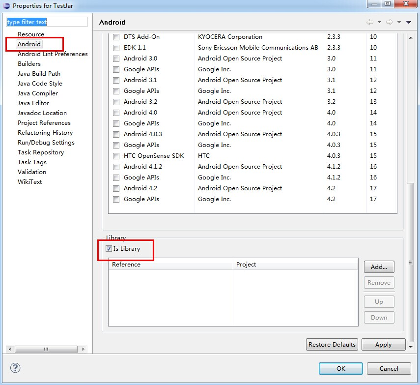
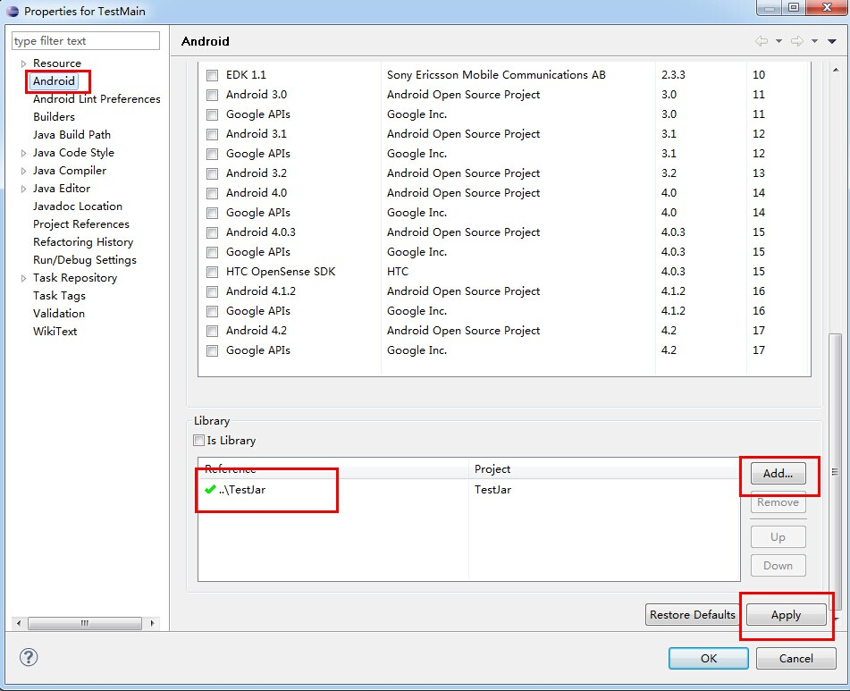
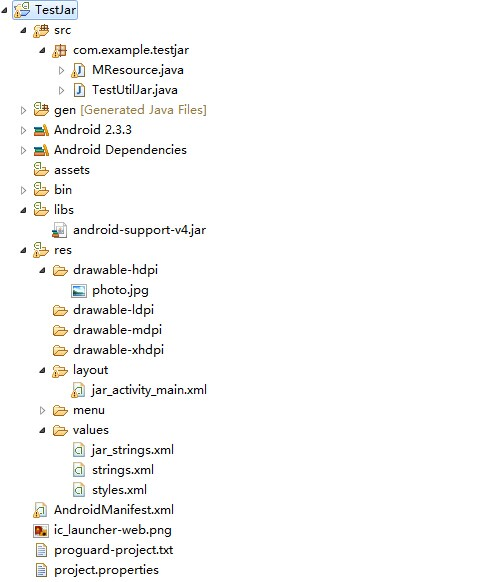
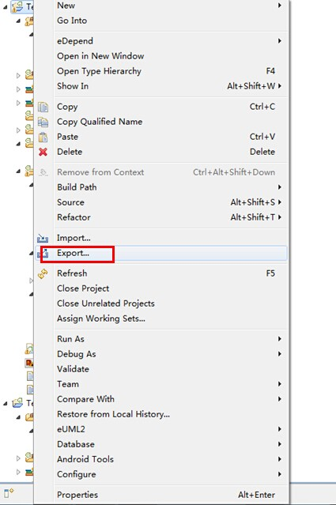
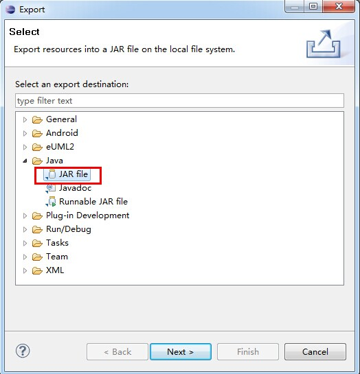
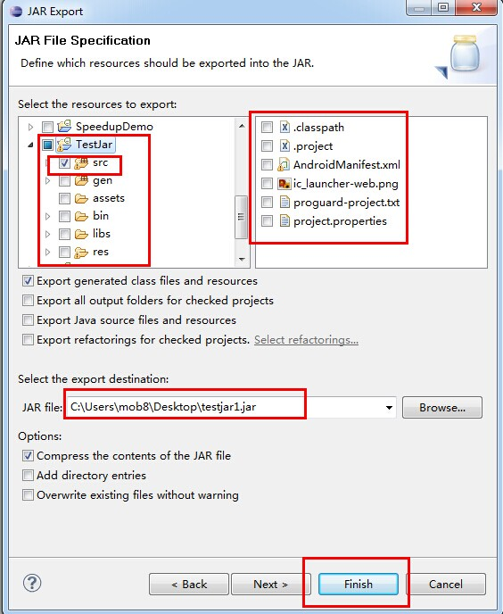
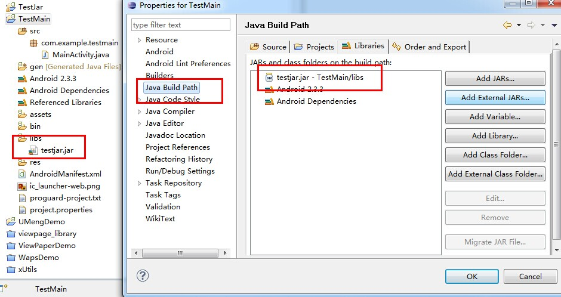
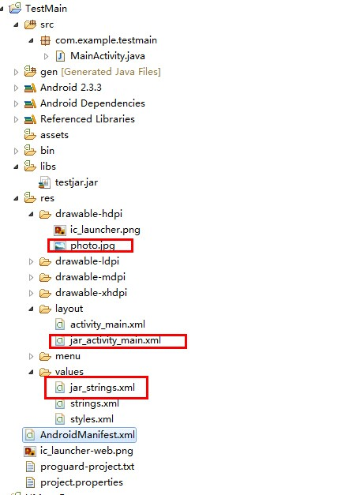

Android 将Activity打成jar包供第三方调用
----------------
> 目的：将Activity打成jar包供第三方调用，解决资源文件不能打包的问题。

* [方案一：项目设置为引用库](#uselibrary)
* [方案二：导出JAR包直接引用](#usejar)

在开发java工程时，一个项目可能分为多个模块，为了实现模块间的解耦和独立，提高模块的复用性，通常将项目按模块分为多个java工程进行开发，最后通过jar包等工程依赖的方式实现系统集成，提高模块的耦合和复用。

现在开发Android项目通过实践和总结，发现这种方式特别有必要，比如开发一个android端的视频播放功能，肯定有播放和下载模块，如果不分开放在一个工程里面不断的添加新的功能，产品的每一个研发都不断的添加修改功能，最后维护越来越难，bug越来越多，并相互推诿，这种方式能避免这种情况，此为有点一。其二呢，下载模块是很多APP都会用到的模块，将其独立出来不断的完善和优化，可以变成一个组件给不同的APP使用，这就提高了模块的代码的解耦，提高的复用性，提高的工作效率，好处大大的哦。

由于Android的特殊性，android不仅有java文件还有res文件，需要研究如何将资源文件以及Activity文件打包成jar文件供其他项目调用，最终多方尝试，找到如下两种解决方案。

<a name="uselibrary"/>
## 方案一：项目设置为引用库 ##
根据Android的官方文档，将其中一个项目设置为引用库，在另一个项目中添加这个库的引用。

**简单的做法是**

在被引用项目TestJar中的project.properties中添加一行

```java
 android.library=true
```

在引用的项目TestMain的project.properties中添加

```java
android.library=false
android.library.reference.1=../TestJar
```

其中1表示引用包的序号，“../TestJar”表示引用项目的路径

**在Eclipse中操作具体做法如下：**

**1. 把普通的android project设置成库项目**
库项目也是一个标准的Android项目，因此你先创建一个普通的Android项目，这个项目可以起任何的名称，任何的包名，设置其他需要设置的字段等。
接着把项目设置成库项目，步骤如下：

1. 在Package Explorer中，鼠标右键项目文件夹（TestJar），点击Properties。
2. 在Properties窗口选择”Android“，Library属性显示在右下边。
3. 把”is Library“单选框选上，在点击Apply。
4. 点击OK关闭Properties。

这时，这个项目就变成库项目了，当然纯的java项目也可以变成库项目，非常简单，执行上面四步就OK了。其他程序项目就可以引用这个库项目了。



**2.引用库项目**

如果你开发的应用程序想要调用库项目中的代码和资源，也easy哦，引用步骤如下：

1. 在Package Explorer中，鼠标右键项目文件夹（TestJar），点击Properties。
2. 在Properties窗口选择”Android“，Library属性显示在右下边。
3. 点击Add，打开了Project Selection对话框。
4. 从可用的库项目列表中选择要添加的库项目，点击OK。
5. 对话框关闭之后点击Apply，（在Properties窗口）。
6. 点击OK，关闭Properties窗口。

完成以上六步，Eclipse会重建项目，把库项目中的内同包含进去。



如果你想增加多个库项目的引用，使用up和down可以设置他们的相对的优先级和合并顺序。工具在合并引用的库的时候顺序是从低优先级（列表的下面）到高优先级（列表的上面）。 如果不只一个库定义了相同的资源ID，这个工具选择资源时会选择高优先级的资源。应用程序自身拥有最高的优先级。

<a name="usejar"/>
## 方案二：导出JAR包直接引用 ##
通过导出JAR包的方式供给其他项目去引用，没有资源包就不多说了直接导出jar包就可以直接引用，下面说一下在有资源包存在的时候打包Jar及引用方式。

**实现步骤：**

1. 我们新建一个工程TestJar，这个就是等下我们要打包成jar工程



**注意：**MResource这个类很重要，主要是它的作用，利用反射根据资源名字获取资源ID（其实系统也自带了根据资源名字获取资源ID的方法getResources().getIdentifier("main_activity", "layout", getPackageName());第一个参数是资源的名字，第二个参数是资源的类型，例如layout, string等，第三个是包名字）

2. MRsource.java代码如下：

```java
package com.example.testjar;
import android.content.Context;
/**
 * 根据资源的名字获取其ID值
 * 
 * @author yangzy
 */
public class MResource {
    public static int getIdByName(Context context, String className, String name) {
        String packageName = context.getPackageName();
        Class r = null;
        int id = 0;
        try {
            r = Class.forName(packageName + ".R");
            Class[] classes = r.getClasses();
            Class desireClass = null;
            for (int i = 0; i < classes.length; ++i) {
                if (classes[i].getName().split("\\$")[1].equals(className)) {
                    desireClass = classes[i];
                    break;
                }
            }
            if (desireClass != null)
                id = desireClass.getField(name).getInt(desireClass);
        } catch (ClassNotFoundException e) {
            e.printStackTrace();
        } catch (IllegalArgumentException e) {
            e.printStackTrace();
        } catch (SecurityException e) {
            e.printStackTrace();
        } catch (IllegalAccessException e) {
            e.printStackTrace();
        } catch (NoSuchFieldException e) {
            e.printStackTrace();
        }
        return id;
    }
}
```

3. TestUtilJar.java实现比较简单一个图片点击后弹出一个Toast

```java
package com.example.testjar;

import android.app.Activity;
import android.content.Context;
import android.os.Bundle;
import android.view.View;
import android.view.View.OnClickListener;
import android.widget.ImageView;
import android.widget.Toast;

public class TestUtilJar extends Activity {
    private ImageView imageView;
    private Context context;

    @Override
    protected void onCreate(Bundle savedInstanceState) {
        super.onCreate(savedInstanceState);
        setContentView(MResource.getIdByName(getApplication(), "layout","jar_activity_main"));
        context = this;
        imageView = (ImageView) findViewById(MResource.getIdByName( getApplication(), "id", "jar_imageView"));
        imageView.setOnClickListener(new OnClickListener() {
                @Override
                public void onClick(View v) {
                    // TODO Auto-generated method stub
                    Toast.makeText(context,
                        "jar = " + getApplication()
                            .getString(MResource.getIdByName(getApplication(),
                                "string", "jar_test_name")), Toast.LENGTH_SHORT)
                         .show();
                }
            });
    }
}

```
4. 布局文件如下：

```xml
<RelativeLayout xmlns:android="http://schemas.android.com/apk/res/android"
    xmlns:tools="http://schemas.android.com/tools"
    android:layout_width="match_parent"
    android:layout_height="match_parent"
    android:background="#00eeff"
    tools:context=".MainActivity" >

    <ImageView
        android:id="@+id/jar_imageView"
        android:layout_width="wrap_content"
        android:layout_height="wrap_content"
        android:layout_centerInParent="true"
        android:layout_marginBottom="80dp"
        android:src="@drawable/photo" />

</RelativeLayout>
```
5. 将TestJar以Jar包形式导出，出去一切资源文件，只导出源码





6. 将导出的testjar1.jar导入到要引用的工程中，先复制到libs下面



7. 最关键一步，将TestJar中引用到的资源文件全部拷贝到TestMain中去，这样就可以顺利的引用资源文件了，还有要用到Jar包中的Activity也需要再TestMain的AndroidManifest.xml配置对应包名的Activity。



8. 在TestMain中引用

```java
package com.example.testmain;
import com.example.testjar.TestUtilJar;

import android.app.Activity;
import android.content.Intent;
import android.os.Bundle;
import android.view.View;
import android.view.View.OnClickListener;
import android.widget.Button;

public class MainActivity extends Activity implements OnClickListener {
    private Button button;

    @Override
    protected void onCreate(Bundle savedInstanceState) {
        super.onCreate(savedInstanceState);
        setContentView(R.layout.activity_main);
        button = (Button) findViewById(R.id.button1);
        button.setOnClickListener(this);
    }

    @Override
    public void onClick(View v) {
        // TODO Auto-generated method stub
        switch (v.getId()) {
            case R.id.button1:
                Intent intent = new Intent(this, TestUtilJar.class);
                startActivity(intent);
                break;
        }
    }

}
```

**总结：**方案一是官方提供的方法应该比较好适合自己公司开发和引用开源代码，但是有的时候是需要给第三方公司提供支持的，当然这个时候不想他们看到我们的源代码，这时候采用方案二是比较理想的。

应该还有更好的实现方式，请大家批评指教，附件里面是源码。累死了终于写完了。

代码下载：
[TestJar.zip](resource/activity_used_in_jar/TestJar.zip)
[TestMain.zip](resource/activity_used_in_jar/TestMain.zip)