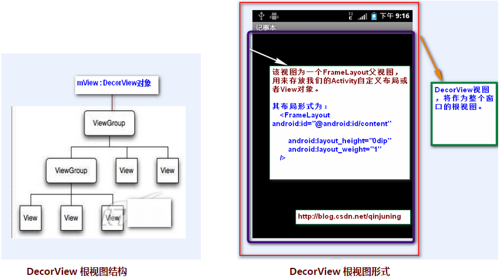

Android中将布局文件/View添加至窗口过程分析---从setContentView()谈起
----------------
本文主要内容是讲解一个视图View或者一个ViewGroup对象是如何添加至应用程序窗口中的。下文中提到的窗口可泛指我们能看到的界面，包括一个Activity呈现的界面(我们可以将之理解为应用程序窗口)，一个Dialog，一个Toast，一个Menu菜单等。
      
首先对相关类的作用进行一下简单介绍：

**Window 类** 位于 /frameworks/base/core/java/android/view/Window.java

**说明：**该类是一个抽象类，提供了绘制窗口的一组通用API。可以将之理解为一个载体，各种View在这个载体上显示。源文件(部分)如下：

```java
public abstract class Window {	
	//...
	//指定Activity窗口的风格类型
    public static final int FEATURE_NO_TITLE = 1;
    public static final int FEATURE_INDETERMINATE_PROGRESS = 5;
    
    //设置布局文件
    public abstract void setContentView(int layoutResID);

    public abstract void setContentView(View view);

    //请求指定Activity窗口的风格类型
    public boolean requestFeature(int featureId) {
        final int flag = 1<<featureId;
        mFeatures |= flag;
        mLocalFeatures |= mContainer != null ? (flag&~mContainer.mFeatures) : flag;
        return (mFeatures&flag) != 0;
    }    
    //...
}
```

**PhoneWindow类** 位于/frameworks/policies/base/phone/com/android/internal/policy/impl/PhoneWindow.java

**说明： **该类继承于Window类，是Window类的具体实现，即我们可以通过该类具体去绘制窗口。并且，该类内部包含了一个DecorView对象，该DectorView对象是所有应用窗口(Activity界面)的根View。 简而言之，PhoneWindow类是把一个FrameLayout类即DecorView对象进行一定的包装，将它作为应用窗口的根View，并提供一组通用的窗口操作接口。源文件(部分)如下： 

```java
public class PhoneWindow extends Window implements MenuBuilder.Callback {
	//...
	// This is the top-level view of the window, containing the window decor.
    private DecorView mDecor;  //该对象是所有应用窗口的根视图 ， 是FrameLayout的子类
    
    //该对象是Activity布局文件的父视图，一般来说是一个FrameLayout型的ViewGroup 
    // 同时也是DecorView对象的一个子视图
    // This is the view in which the window contents are placed. It is either
    // mDecor itself, or a child of mDecor where the contents go.
    private ViewGroup mContentParent; 
    
    //设置标题
    @Override
    public void setTitle(CharSequence title) {
        if (mTitleView != null) {
            mTitleView.setText(title);
        }
        mTitle = title;
    }
    //设置背景图片
    @Override
    public final void setBackgroundDrawable(Drawable drawable) {
        if (drawable != mBackgroundDrawable || mBackgroundResource != 0) {
            mBackgroundResource = 0;
            mBackgroundDrawable = drawable;
            if (mDecor != null) {
                mDecor.setWindowBackground(drawable);
            }
        }
    }
    //...    
}
```

**DecorView类** 该类是PhoneWindow类的内部类
**说明：** 该类是一个FrameLayout的子类，并且是PhoneWindow的子类，该类就是对普通的FrameLayout进行功能的扩展，更确切点可以说是修饰(Decor的英文全称是Decoration，即“修饰”的意思)，比如说添加TitleBar(标题栏)，以及TitleBar上的滚动条等 。最重要的一点是，它是所有应用窗口的根View 。如下所示 ：



源文件(部分)如下：

```java
private final class DecorView extends FrameLayout {
	//...
	//触摸事件处理
	@Override
    public boolean onTouchEvent(MotionEvent event) {
        return onInterceptTouchEvent(event);
    }
	//...
}
```

打个不恰当比喻吧，Window类相当于一幅画(抽象概念，什么画我们未知) ，PhoneWindow为一副齐白石先生的山水画(具体概念，我们知道了是谁的、什么性质的画)，DecorView则为该山水画的具体内容(有山、有水、有树，各种界面)。DecorView呈现在PhoneWindow上。当系统(一般是ActivityManagerService)配置好启动一个Activity的相关参数(包括Activity对象和Window对象信息)后，就会回调Activity的onCreate()方法，在其中我们通过设置setContentView()方法类设置该Activity的显示界面，整个调用链由此铺垫开来。setContentView()的三个构造方法调用流程本质上是一样的，我们就分析setContentView(intresId)方法。

### Step 1  、Activity.setContentView(intresId) ###
该方法在Activity类中该方法只是简单的回调Window对象，具体为PhoneWindow对象setContentView()方法实现 。

```java
	public void setContentView(int layoutResID) {
	    getWindow().setContentView(layoutResID);
	}

	public Window getWindow() {
	    return mWindow;   //Window对象，本质上是一个PhoneWindow对象
	}
```

###  Step 2  、PhoneWindow.setContentView()   ###
该方法在PhoneWindow类中 

```java
	@Override
	public void setContentView(int layoutResID) {
		//是否是第一次调用setContentView方法， 如果是第一次调用，则mDecor和mContentParent对象都为空
	    if (mContentParent == null) {
	        installDecor();
	    } else {
	        mContentParent.removeAllViews();
	    }
	    mLayoutInflater.inflate(layoutResID, mContentParent);
	    final Callback cb = getCallback();
	    if (cb != null) {
	        cb.onContentChanged();
	    }
	}
```

该方法根据首先判断是否已经由setContentView()了获取mContentParent即View对象， 即是否是第一次调用该PhoneWindow对象setContentView()方法。如果是第一次调用，则调用installDecor()方法，否则，移除该mContentParent内所有的所有子View。最后将我们的资源文件通过LayoutInflater对象转换为View树，并且添加至mContentParent视图中。

***PS：***因此，在应用程序里，我们可以多次调用setContentView()来显示我们的界面。

###  Step 3、 PhoneWindow. installDecor()   ###
该方法在PhoneWindow类中

```java
	private void installDecor() {
	    if (mDecor == null) {
	    	//mDecor为空，则创建一个Decor对象
	        mDecor = generateDecor();
	        mDecor.setDescendantFocusability(ViewGroup.FOCUS_AFTER_DESCENDANTS);
	        mDecor.setIsRootNamespace(true);
	    }
	    if (mContentParent == null) {
	    	//generateLayout()方法会根据窗口的风格修饰，选择对应的修饰布局文件
	    	//并且将id为content(android:id="@+id/content")的FrameLayout赋值给mContentParent
	        mContentParent = generateLayout(mDecor);
	        
	        //...
	}
```

首先、该方法首先判断mDecor对象是否为空，如果不为空，则调用generateDecor()创建一个DecorView(该类是FrameLayout子类，即一个ViewGroup视图)；generateDecor()方法原型为:

```java
    protected DecorView generateDecor() {
        return new DecorView(getContext(), -1);
    }
```

其次、继续判断mContentParent对象是否为空，如果不为空，则调用generateLayout()方法去创建mContentParent对象。generateLayout()方法如下：

```java
    protected ViewGroup generateLayout(DecorView decor) {
        // Apply data from current theme.

        //...1、根据requestFreature()和Activity节点的android:theme="" 设置好 features值
    	
    	//2 根据设定好的 features值，即特定风格属性，选择不同的窗口修饰布局文件
        int layoutResource;  //窗口修饰布局文件  
        int features = getLocalFeatures();
        // System.out.println("Features: 0x" + Integer.toHexString(features));
        if ((features & ((1 << FEATURE_LEFT_ICON) | (1 << FEATURE_RIGHT_ICON))) != 0) {
            if (mIsFloating) {
                layoutResource = com.android.internal.R.layout.dialog_title_icons;
            } else {
                layoutResource = com.android.internal.R.layout.screen_title_icons;
            }
            // System.out.println("Title Icons!");
        } else if ((features & ((1 << FEATURE_PROGRESS) | (1 << FEATURE_INDETERMINATE_PROGRESS))) != 0) {
            // Special case for a window with only a progress bar (and title).
            // XXX Need to have a no-title version of embedded windows.
            layoutResource = com.android.internal.R.layout.screen_progress;
            // System.out.println("Progress!");
        } 
        //...
        
        //3 选定了窗口修饰布局文件 ，添加至DecorView对象里，并且指定mcontentParent值
        View in = mLayoutInflater.inflate(layoutResource, null);
        decor.addView(in, new ViewGroup.LayoutParams(MATCH_PARENT, MATCH_PARENT));

        ViewGroup contentParent = (ViewGroup)findViewById(ID_ANDROID_CONTENT);
        if (contentParent == null) {
            throw new RuntimeException("Window couldn't find content container view");
        }

        if ((features & (1 << FEATURE_INDETERMINATE_PROGRESS)) != 0) {
            ProgressBar progress = getCircularProgressBar(false);
            if (progress != null) {
                progress.setIndeterminate(true);
            }
        }
        //...
        return contentParent;
    }
```

该方法会做如下事情：

**1.**根据窗口的风格修饰类型为该窗口选择不同的窗口布局文件(根视图)。这些窗口修饰布局文件指定一个用来存放Activity自定义布局文件的ViewGroup视图，一般为FrameLayout 其id 为： android:id="@android:id/content"。例如窗口修饰类型包括FullScreen(全屏)、NoTitleBar(不含标题栏)等。选定窗口修饰类型有两种：

* 指定requestFeature()指定窗口修饰符，PhoneWindow对象调用getLocalFeature()方法获取值；
* 为我们的Activity配置相应属性，即android：theme=“”，PhoneWindow对象调用getWindowStyle()方法获取值。
 
举例如下，隐藏标题栏有如下方法：requestWindowFeature(Window.FEATURE_NO_TITLE);或者 为Activity配置xml属性：android:theme=”@android:style/Theme.NoTitleBar”。

***PS：***因此，在Activity中必须在setContentView之前调用requestFeature()方法。

确定好窗口风格之后，选定该风格对应的布局文件，这些布局文件位于 frameworks/base/core/res/layout/，典型的窗口布局文件有：

* R.layout.dialog_titile_icons                          
* R.layout.screen_title_icons
* R.layout.screen_progress
* R.layout.dialog_custom_title
* R.layout.dialog_title   
* R.layout.screen_title// 最常用的Activity窗口修饰布局文件
* R.layout.screen_simple //全屏的Activity窗口布局文件

分析Activity最常用的一种窗口布局文件，R.layout.screen_title：
```xml
    <!--
    This is an optimized layout for a screen, with the minimum set of features
    enabled.
    -->

    <LinearLayout xmlns:android="http://schemas.android.com/apk/res/android"
        android:orientation="vertical"
        android:fitsSystemWindows="true">
        <FrameLayout
            android:layout_width="match_parent" 
            android:layout_height="?android:attr/windowTitleSize"
            style="?android:attr/windowTitleBackgroundStyle">
            <TextView android:id="@android:id/title" 
                style="?android:attr/windowTitleStyle"
                android:background="@null"
                android:fadingEdge="horizontal"
                android:gravity="center_vertical"
                android:layout_width="match_parent"
                android:layout_height="match_parent" />
        </FrameLayout>
        <FrameLayout android:id="@android:id/content"
            android:layout_width="match_parent" 
            android:layout_height="0dip"
            android:layout_weight="1"
            android:foregroundGravity="fill_horizontal|top"
            android:foreground="?android:attr/windowContentOverlay" />
    </LinearLayout>
```

该布局文件很简单，一个LinearLayout下包含了两个子FrameLayout视图，第一个FrameLayout用来显示标题栏(TitleBar)，该TextView 视图id为title(android:id="@android:id/title")；第二个FrameLayout用来显示我们Activity的布局文件的父视图，该FrameLayoutid为content(android:id="@android:id/content") 。

全屏的窗口布局文件 R.layout.screen_simple:

```xml
    <--This is an optimized layout for a screen, with the minimum set of features
    enabled.
    -->

    <FrameLayout xmlns:android="http://schemas.android.com/apk/res/android"
        android:id="@android:id/content"
        android:fitsSystemWindows="true"
        android:foregroundInsidePadding="false"
        android:foregroundGravity="fill_horizontal|top"
        android:foreground="?android:attr/windowContentOverlay" />
```

该布局文件只有一个FrameLayout，用来显示我们Activity的布局文件，该FrameLayoutid为android:id="@android:id/content"

**2.**前面一步我们确定窗口修饰布局文件后，mDecor做为根视图将该窗口布局对应的视图添加进去，并且获取id为content的View，将其赋值给mContentParent对象，即我们前面中提到的第二个FrameLayout。At Last、产生了mDecor和mContentParent对象后，就将我们的Activity布局文件直接添加至mContentParent父视图中即可。我们再次回到 Step 2 中PhoneWindow.setContentView()该方法在PhoneWindow类中

```java
    @Override
    public void setContentView(int layoutResID) {
        if (mContentParent == null) {
            installDecor();
        } else {
            mContentParent.removeAllViews();
        }
        mLayoutInflater.inflate(layoutResID, mContentParent);
        final Callback cb = getCallback();
        if (cb != null) {
            cb.onContentChanged();
        }
    }
```

整个过程主要是如何把Activity的布局文件添加至窗口里，上面的过程可以概括为：

1. 创建一个DecorView对象，该对象将作为整个应用窗口的根视图
2. 创建不同的窗口修饰布局文件，并且获取Activity的布局文件该存放的地方，由该窗口修饰布局文件内id为content的FrameLayout指定 。
3. 将Activity的布局文件添加至id为content的FrameLayout内。最后，当AMS(ActivityManagerService)准备resume一个Activity时，会回调该Activity的handleResumeActivity()方法，该方法会调用Activity的makeVisible方法 ,显示我们刚才创建的mDecor 视图族。

```java
    //系统resume一个Activity时，调用此方法
    final void handleResumeActivity(IBinder token, boolean clearHide, boolean isForward) {
    	ActivityRecord r = performResumeActivity(token, clearHide);
    	//...
    	 if (r.activity.mVisibleFromClient) {
             r.activity.makeVisible();
         }
    }
```

handleResumeActivity()方法原型如下： 位于ActivityThread类中
```java
    void makeVisible() {
        if (!mWindowAdded) {
            ViewManager wm = getWindowManager();   // 获取WindowManager对象
            wm.addView(mDecor, getWindow().getAttributes());
            mWindowAdded = true;
        }
        mDecor.setVisibility(View.VISIBLE); //使其处于显示状况
    }
```

接下来就是，如何把我们已经创建好的窗口通知给WindowManagerService ，以便它能够把这个窗口显示在屏幕上。关于这方面内容大家可以去看邓凡平老师的这篇博客《[Android深入浅出之Surface[1]](http://www.cnblogs.com/innost/archive/2011/02/05/1949240.html)》