HTTP协议之状态码详解
----------------
## 目录 ##
* [前言](#preface)
* [什么是HTTP状态码](#what)
* [状态码分类](#category)
* [常见的状态码](#Common)
* [1XX 信息性状态码](#1XX)
* [2XX 成功状态码](#2XX)
* [3XX 重定向状态码](#3XX)
* [4XX 客户端错误状态码](#4XX)
* [5XX 服务器错误状态码](#5XX)
* [204 No Content(没有内容)](#204)
* [206 Partial Content(部分内容)](#206)
* [301 Moved Permanently（永久移除)](#301)
* [400 Bad Request（坏请求)](#400)
* [403 Forbidden(禁止)](#403)
* [405 Method Not Allowed(不允许使用的方法)](#405)
* [411 Length Required（要求长度指示）](#411)
* [413 Request Entity Too Large（请求实体太大）](#413)
* [414 Request URI Too Long(请求URI太长)](#414)
* [500 Internal Server Error(内部服务器错误)](#500)
* [501 Not Implemented(未实现)](#501)
* [502 Bad Gateway（网关故障）](#502)
* [505 HTTP Version Not Supported(不支持的HTTP版本)](#505)

<a name="preface"/>
##  前言 ##
HTTP状态码，我都是现查现用。 我以前记得几个常用的状态码，比如200，302，304，404， 503。 一般来说我也只需要了解这些常用的状态码就可以了。  如果是做AJAX，REST,网络爬虫，机器人等程序。还是需要了解其他状态码。  本文我花了一个多月的时间把所有的状态码都总结了下，内容太多，看的时候麻烦耐心点了。

HTTP状态码的学习资料到处都有，但是都是理论上讲解。  本文介绍HTTP协议中的HTTP状态码（HTTP Status Code）， 会对大部分的状态码都进行了详细的实例讲解。

要了解状态码，应该在实例中去理解状态码的意义，否则看了也会忘记的。

用Fiddler工具可以查看HTTP Request和Response, 还可以方便地查看Response中的状态码， 如果不熟悉这个工具，可以先参考【[Fiddler教程](http://www.cnblogs.com/TankXiao/archive/2012/02/06/2337728.html)】

为了重现HTTP 状态码，本文会使用Fiddler Composer来创建“特殊的HTTP Request”.  可以参考【[Fiddler Composer创建和发送HTTP Request](http://www.cnblogs.com/TankXiao/archive/2012/12/25/2829709.html)】

<a name="what"/>
## 什么是HTTP状态码 ##
HTTP状态码的作用是：Web服务器用来告诉客户端，发生了什么事。

状态码位于HTTP Response 的第一行中，会返回一个”三位数字的状态码“和一个“状态消息”。 ”三位数字的状态码“便于程序进行处理， “状态消息”更便于人理解。 

如下图，  当客户端请求一个不存在的URL的时候， Web服务器会返回 “HTTP/1.1 404 Not Found” 告诉浏览器客户端。 服务器无法找到所请求的URL。

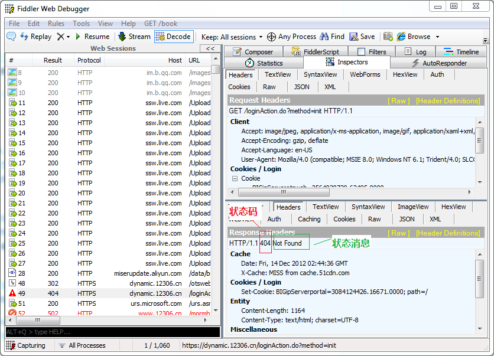

<a name="category"/>
## 状态码分类 ##
HTTP状态码被分为五大类， 目前我们使用的HTTP协议版本是1.1， 支持以下的状态码。随着协议的发展，HTTP规范中会定义更多的状态码。 

**小技巧**：  假如你看到一个状态码518， 你并不知道具体518是什么意思。 这时候你只要知道518是属于（5XX，服务器错误就可以了）

|       | 已定义范围 | 分类 |
| ----- | ------ | ------- |
| 1XX | 100-101  | 信息提示  |
| 2XX | 200-206  | 成功  |
| 3XX | 300-305  | 重定向  |
| 4XX | 400-415  | 客户端错误  |
| 5XX | 500-505  | 服务器错误  |

<a name="Common"/>
## 常见的状态码 ##
一般人只需要了解以下常见的状态码就够了， 如果你想了解更多， 请继续往下看。

|       |  
| ----- |
| 200 OK 服务器成功处理了请求（这个是我们见到最多的） |
| 301/302 Moved Permanently（重定向）请求的URL已移走。Response中应该包含一个Location URL, 说明资源现在所处的位置 |
| 304 Not Modified（未修改）客户的缓存资源是最新的， 要客户端使用缓存 |
| 404 Not Found 未找到资源 |
| 200 OK 服务器成功处理了请求（这个是我们见到最多的） |
| 501 Internal Server Error服务器遇到一个错误，使其无法对请求提供服务 |

<a name="1XX"/>
## 1XX 信息性状态码 ##
这些状态码是HTTP 1.1引入的。 对于这些状态码的价值还存在争论 （*我个人从来没见过这些状态码， 也没有理解这些状态码。*）

| 状态码 | 状态消息 | 含义 |
| ----- | ------ | ------- |
| 100 | Continue(继续)  | 收到了请求的起始部分，客户端应该继续请求  |
| 101 | Switching Protocols（切换协议）  | 服务器正根据客户端的指示将协议切换成Update Header列出的协议  |

<a name="2XX"/>
## 2XX 成功状态码 ##
客户端发起请求时， 这些请求通常都是成功的。服务器有一组用来表示成功的状态码，分别对应于不同类型的请求。

| 状态码 | 状态消息 | 含义 |
| ----- | ------- | ------- |
| 200 | OK  | 服务器成功处理了请求（这个是我们见到最多的）  |
| 201 | Created（已创建）| 对于那些要服务器创建对象的请求来说，资源已创建完毕。|
| 202 | Accepted（已接受）| 请求已接受， 但服务器尚未处理  |
| 203 | Non-Authoritative Information（非权威信息）  | 服务器已将事务成功处理，只是实体Header包含的信息不是来自原始服务器，而是来自资源的副本。  |
| 204 | No Content(没有内容)  | Response中包含一些Header和一个状态行， 但不包括实体的主题内容（没有response）  |
| 205 | Reset Content(重置内容)  | 另一个主要用于浏览器的代码。意思是浏览器应该重置当前页面上所有的HTML表单。  |
| 206 | Partial Content（部分内容）  |  部分请求成功  |

<a name="3XX"/>
## 3XX 重定向状态码 ##
重定向状态码用来告诉浏览器客户端，它们访问的资源已被移动， Web服务器发送一个重定向状态码和一个可选的Location Header, 告诉客户端新的资源地址在哪。

浏览器客户端会自动用Location中提供的地址，重新发送新的Request。 这个过程对用户来说是透明的。

301和302 非常相似，  一个是永久转移，一个是临时转移。  

`（SEO中，搜索引擎如果碰到301， 比如网页A用301重定向到网页B，搜索引擎可以肯定网页A永久性改变地址，就会把网页B当做唯一有效目标）`

302，303，307 是一样。  这是因为302是HTTP 1.0定义的， HTTP1.1中使用303,307. 同时又保留了302.  （但在现实中，我们还是用302，我是没见过303和307）

所以这一节， 我们只需要掌握302， 304 就可以了。

| 状态码 | 状态消息 | 含义 |
| ----- | ------- | ------- |
| 300 | Multiple Choices（多项选择）| 客户端请求了实际指向多个资源的URL。这个代码是和一个选项列表一起返回的，然后用户就可以选择他希望的选项了  |
| 301 | Moved Permanently（永久移除) | 请求的URL已移走。Response中应该包含一个Location URL, 说明资源现在所处的位置 |
| 302 | Found（已找到）  | 与状态码301类似。但这里的移除是临时的。 客户端会使用Location中给出的URL，重新发送新的HTTP request  |
| 303 | See Other（参见其他） | 类似302 |
| 304 | Not Modified（未修改） | 客户的缓存资源是最新的， 要客户端使用缓存 |
| 305 | Use Proxy（使用代理）  | 必须通过代理访问资源， 代理的地址在Response 的Location中 |
| 306 | 未使用  |  这个状态码当前没使用 |
| 307 | Temporary Redirect（临时重定向) | 类似302 |

<a name="4XX"/>
## 4XX 客户端错误状态码 ##
有时客户端会发送一些服务器无法处理的东西，比如格式错误的Request, 或者最常见的是， 请求一个不存在的URL。

| 状态码 | 状态消息 | 含义 |
| ----- | ------- | ------- |
| 400 | Bad Request（坏请求）  | 告诉客户端，它发送了一个错误的请求。 |
| 401 | Unauthorized（未授权）  | 需要客户端对自己认证  |
| 402 | Payment Required（要求付款） | 这个状态还没被使用， 保留给将来用 |
| 403 | Forbidden（禁止） | 请求被服务器拒绝了  |
| 404 | Not Found（未找到） | 未找到资源  |
| 405 | Method Not Allowed（不允许使用的方法）  | 不支持该Request的方法。 |
| 406 | Not Acceptable（无法接受） |  |
| 407 | Proxy Authentication Required(要求进行代理认证) | 与状态码401类似， 用于需要进行认证的代理服务器 |
| 408 | Request Timeout（请求超时） | 如果客户端完成请求时花费的时间太长， 服务器可以回送这个状态码并关闭连接 |
| 409 | Conflict（冲突） | 发出的请求在资源上造成了一些冲突 |
| 410 | Gone（消失了） | 服务器曾经有这个资源，现在没有了， 与状态码404类似 |
| 411 | Length Required（要求长度指示） | 服务器要求在Request中包含Content-Length。 |
| 412 | Precondition Failed（先决条件失败）|   |
| 413 | Request Entity Too Large（请求实体太大） | 客户端发送的实体主体部分比服务器能够或者希望处理的要大 |
| 414 | Request URI Too Long（请求URI太长） | 客户端发送的请求所携带的URL超过了服务器能够或者希望处理的长度 |
| 415 | Unsupported Media Type（不支持的媒体类型） | 服务器无法理解或不支持客户端所发送的实体的内容类型 |
| 416 | Requested Range Not Satisfiable（所请求的范围未得到满足） |  |
| 417 | Expectation Failed（无法满足期望） |   |

<a name="5XX"/>
## 5XX 服务器错误状态码 ##
有时候客户端发送了一条有效Request, Web服务器自身却出错了。 可能是Web服务器运行出错了， 或者网站都挂了。  5XX就是用来描述服务器错误的。

| 状态码 | 状态消息 | 含义 |
| ----- | ------- | ------- |
| 500 | Internal Server Error(内部服务器错误)  | 服务器遇到一个错误，使其无法为请求提供服务 |
| 501 | Not Implemented（未实现）  | 客户端发起的请求超出服务器的能力范围(比如，使用了服务器不支持的请求方法)时，使用此状态码。 |
| 502 | Bad Gateway（网关故障） | 代理使用的服务器遇到了上游的无效响应 |
| 503 | Service Unavailable（未提供此服务）  | 服务器目前无法为请求提供服务，但过一段时间就可以恢复服务 |
| 504 | Gateway Timeout（网关超时）  | 与状态吗408类似， 但是响应来自网关或代理，此网关或代理在等待另一台服务器的响应时出现了超时 |
| 505 | HTTP Version Not Supported（不支持的HTTP版本） | 服务器收到的请求使用了它不支持的HTTP协议版本。 有些服务器不支持HTTP早期的HTTP协议版本，也不支持太高的协议版本 |

<a name="204"/>
## 204 No Content(没有内容) ##
返回的Response中只有一些Header和一个状态行， 没有实体的主题内容（没有response body）

204状态码的作用在于： 

1. 在不获取资源的情况下了解资源的情况（比如判断其类型）
2. 通过查看Response中的状态码， 看看某个对象是否存在
3. 通过查看Header, 测试资源是否被修改了。

实例：先打开Fiddler, 然后启动浏览器访问ditu.google.cn,  你会捕获到很多204

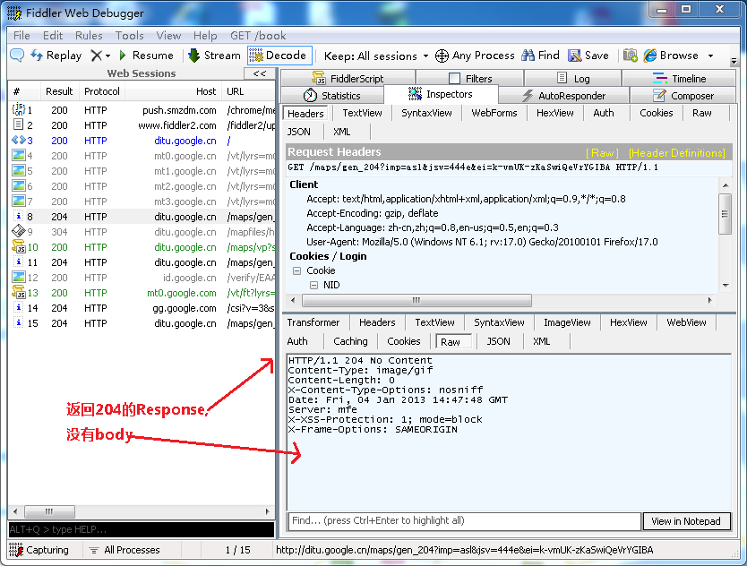

<a name="206"/>
## 206 Partial Content(部分内容) ##
206状态码代表服务器已经成功处理了部分GET请求（只有发送GET 方法的request, web服务器才可能返回206）

应用场景：

1. FlashGet, 迅雷或者HTTP下载工具都是使用206状态码来实现断点续传
2. 将以个大文档分解为多个下载段同时下载 比如，在线看视频

实例：　一些流媒体技术比如在线视频，可以边看边下载。　就是使用206来实现的。

打开Fiddler， 然后用浏览器打开“搜狐视频中的绿箭侠” [http://tv.sohu.com/20121011/n354681393.shtml](http://tv.sohu.com/20121011/n354681393.shtml) 然后你在Fiddler中就能看到一堆的206

1. 浏览器发送一个Get 方法的request.  header中包含 Range: bytes=5303296-5336063. (意思就是请求得到5303296-5336063这个范围的数据)。
2. Web服务器返回一个206 的Response. header中包含Content-Range: bytes 5303296-5336063/12129376(表明这次返回的内容范围)

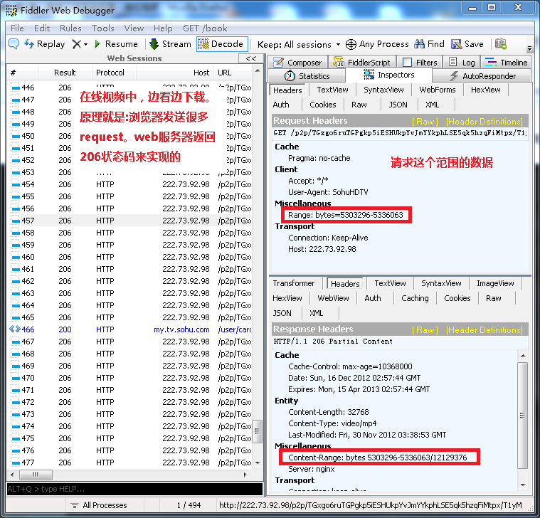

<a name="301"/>
## 301 Moved Permanently（永久移除) ##
请求的URL已移走。Response中应该包含一个Location URL, 说明资源现在所处的位置

例如：  

1.  浏览器客户端访问 http://map.google.cn
2. Web服务器返回Response 301，Location=http://titu.google.cn  （告诉客户端我们的资源位于这里， ）
3. 浏览器客户端会自动再发送一个Request 去访问http://titu.google.cn

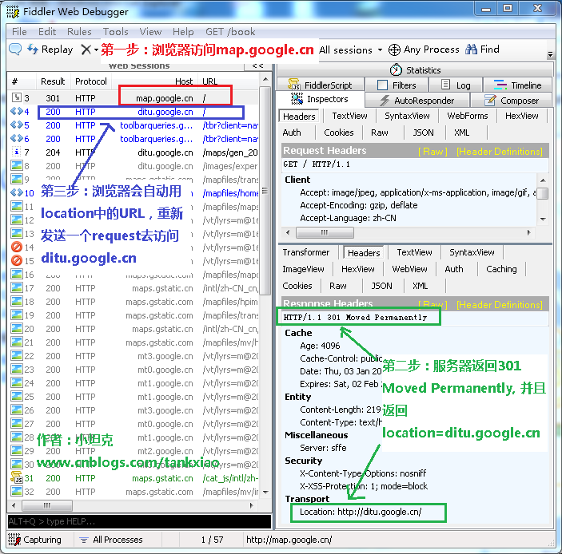

<a name="400"/>
## 400 Bad Request（坏请求) ##
发送的Request中的数据有错误(比如：表单有错误，Cookie有错误)，  这个我们也经常见到。 

实例： 还没想到， 想到了再贴个实例上来。

<a name="403"/>
## 403 Forbidden(禁止) ##
Web客户端发送的请求被Web服务器拒绝了， 如果服务器想说明为什么拒绝请求，可以包含实体的主体部分来对原因进行描述。但这个状态码通常是服务器不想说明拒绝原因。

访问下面的URL， 会被服务器拒绝. 并且返回403状态码

[http://t2.baidu.com/it/u=1791561788,200960144&fm=0&gp=0.jpg](http://t2.baidu.com/it/u=1791561788,200960144&fm=0&gp=0.jpg)

<a name="405"/>
## 405 Method Not Allowed(不允许使用的方法) ##
405是指Web服务器不支持Request中的方法。

我个人认为状态码405Method Not Allowed和501 Not Implemented 是一样的意思。都是不支持Request的方法。 （目前我还不知道这两个的区别）

实例:  发送一个是trace方法的Request 给www.google.com

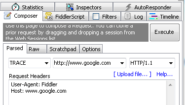
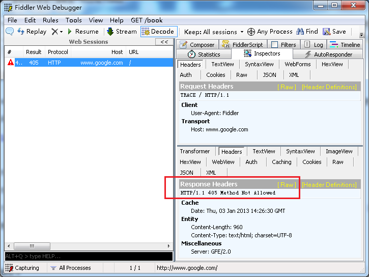

<a name="411"/>
## 411 Length Required（要求长度指示） ##
服务器要求在Request中包含Content-Length。

当浏览器使用Post方法，发送数据给Web服务器时， 必须要有Content-Length。这样Web服务器才知道你要发送多少数据，否则Web服务器会返回411状态码

实例： 发送一个Post方法的Request 给www.google.com.   Request中没有Content-Length

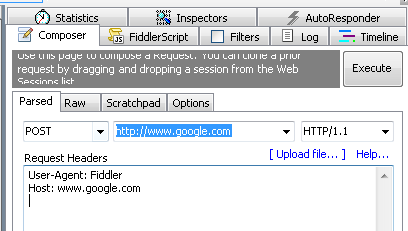
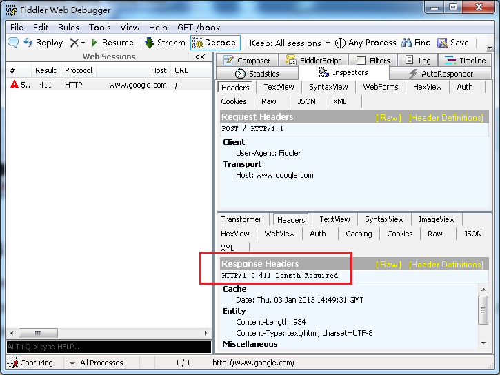

<a name="413"/>
## 413 Request Entity Too Large（请求实体太大） ##
作用：客户端发送的实体主体部分比服务器能够或者希望处理的要大。  一般情况下我们看不到这个状态码。 因为浏览器不会发送太大的数据给网站，但是机器人可能会。

实例: 用post方法发送一个大文件(100MB以上)给www.google.com

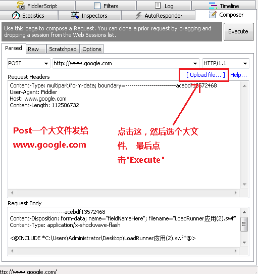
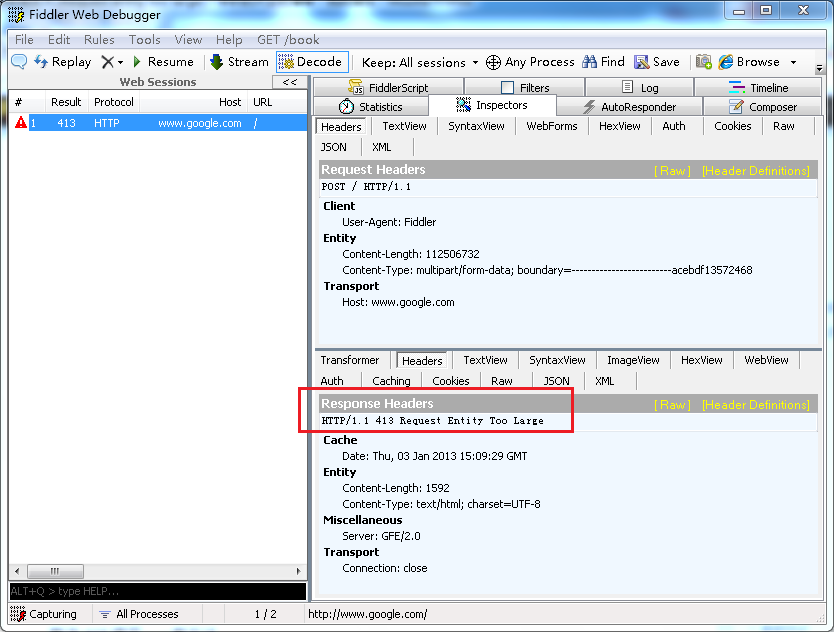

<a name="414"/>
## 414 Request URI Too Long(请求URI太长) ##
就是说Request URI太长， 一般浏览器本身对URI的长度就会有限制，所以不会发送URI很长的Request. 我们平常是根本看不到414错误的。 但是机器人可以发送很长URI。

例如：我们用Fiddler Composer发送一个很长的URI给Google, 比如 "www.google.com?q=asdfasdasf.."  q=后面的参数很长。 就可以看到414了

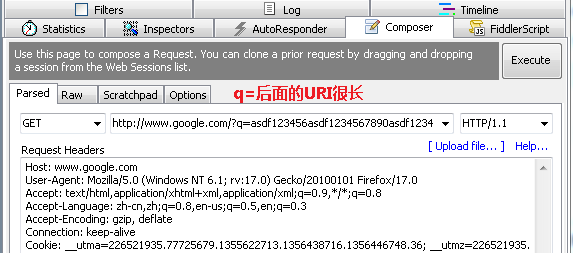
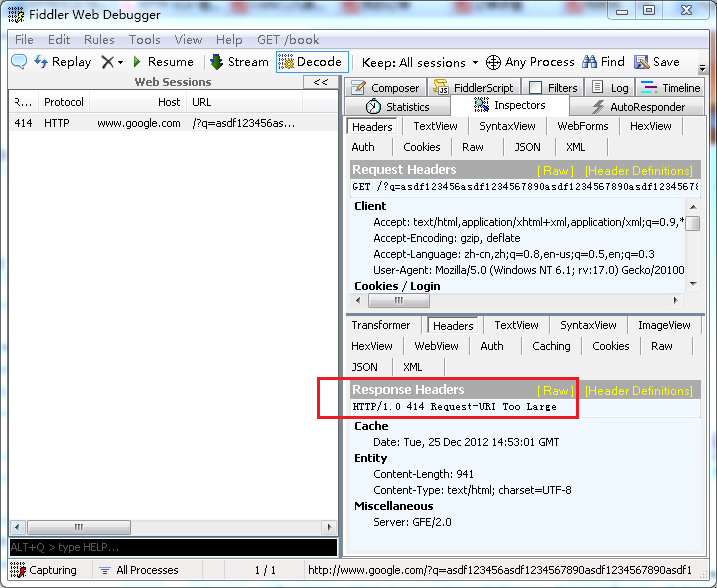

<a name="500"/>
## 500 Internal Server Error(内部服务器错误) ##
这个太常见了， 我们开发网站的时候，当我们的程序出错了时，就会返回500错误。

实例：ASP.NET 程序出错

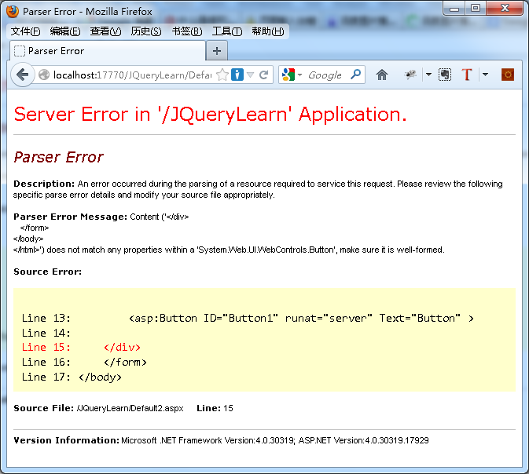
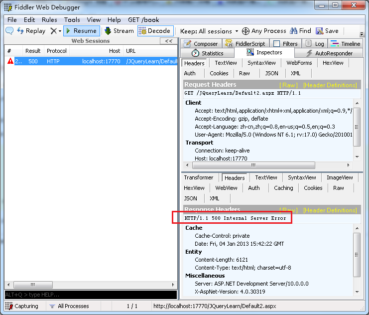

<a name="501"/>
## 501 Not Implemented(未实现) ##
客户端发起的请求超出服务器的能力范围(比如，使用了服务器不支持的请求方法)时，使用此状态码）。  一般的Web服务器只支持GET和POST方法。

实例： 使用Fiddler Composer 给www.qq.com,  发送一个OPTIONS 方法的Request.   服务器就能返回501了。

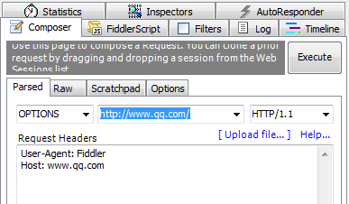
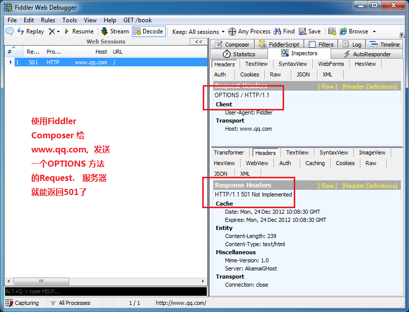

<a name="502"/>
## 502 Bad Gateway（网关故障） ##
代理使用的服务器遇到了上游的无效响应。  

Fiddler本身就是代理服务器。  当我们访问www.facebook.com，这网站被我们天朝屏蔽了。 所以我们可以得到502

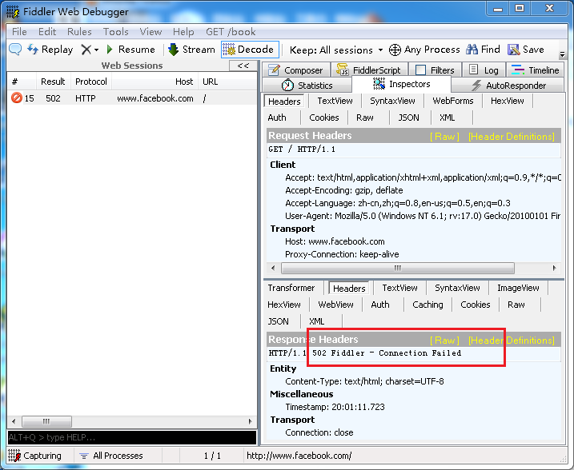

<a name="505"/>
## 505 HTTP Version Not Supported(不支持的HTTP版本) ##
表示Web服务器不支持此HTTP协议的版本。  

众所周知我们现在使用的HTTP协议版本是HTTP/1.1， 如果我们发送一个HTTP/2.0 的request 给博客园， 博客园肯定不能支持HTTP/2.0，所以会返回505 

想要发送这样的request, 可以使用Fiddler工具中的Composer来发送自定义的request, 如下图。

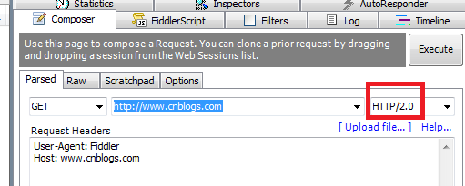
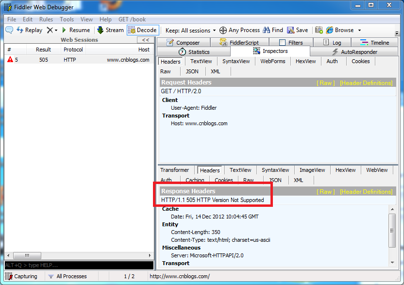