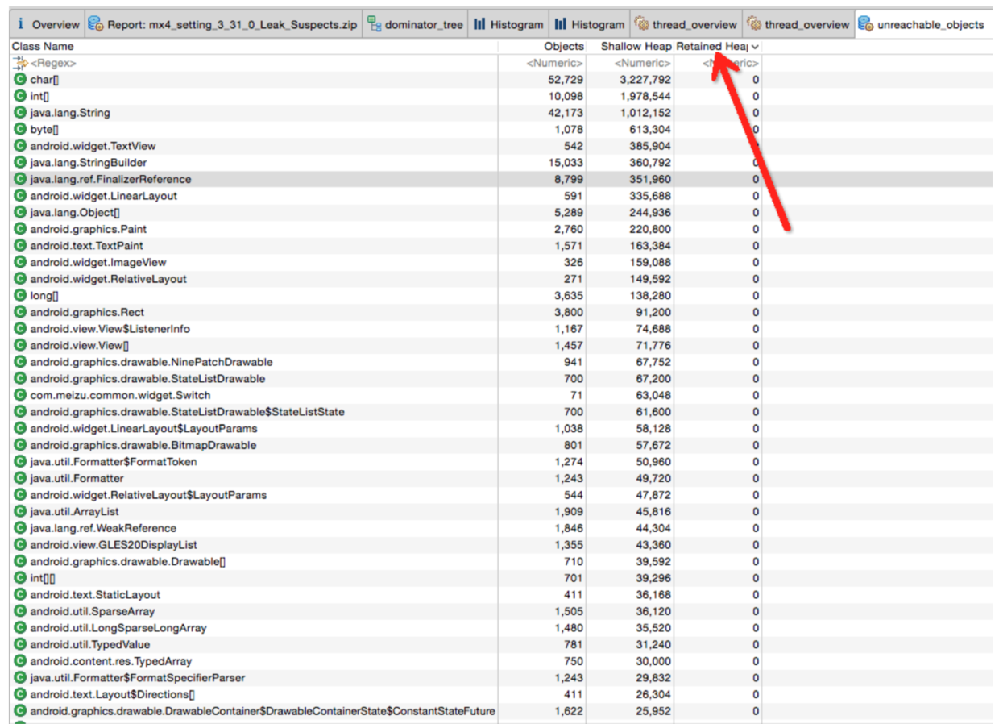

Android内存优化之MAT使用
====
# 第一部分：MAT使用入门 #
## MAT介绍 ##
MAT(Memory Analyzer Tool)，一个基于Eclipse的内存分析工具，是一个快速、功能丰富的JAVA heap分析工具，它可以帮助我们查找内存泄漏和减少内存消耗。使用内存分析工具从众多的对象中进行分析，快速的计算出在内存中对象的占用大小，看看是谁阻止了垃圾收集器的回收工作，并可以通过报表直观的查看到可能造成这种结果的对象。


当然MAT也有独立的不依赖Eclipse的版本，只不过这个版本在调试Android内存的时候，需要将DDMS生成的文件进行转换，才可以在独立版本的MAT上打开。不过Android SDK中已经提供了这个Tools，所以使用起来也是很方便的。

## MAT工具的下载安装 ##
这里是MAT的下载地址：[https://eclipse.org/mat/downloads.php](https://eclipse.org/mat/%20downloads.php)，下载时会提供三种选择的方式：


* Update Site 这种方式后面会有一个网址：比如http://download.eclipse.org/mat/1.4/update-site/ ，安装过Eclipse插件的同学应该知道，只要把这段网址复制到对应的Eclipse的Install New Software那里，就可以进行在线下载了。


* Archived Update Site 这种方式安装的位置和上一种差不多，只不过第一种是在线下载，这一种是使用离线包进行更新，这种方式劣势是当这个插件更新后，需要重新下载离线包，而第一种方式则可以在线下载更新。
* Stand-alone Eclipse RCP Applications 这种方式就是把MAT当成一个独立的工具使用，不再依附于Eclipse，适合不使用Eclipse而使用Android Studio的同学。这种方式有个麻烦的地方就是DDMS导出的文件，需要进行转换才可以在MAT中打开。

下载安装好之后，就可以使用MAT进行实际的操作了。

## Android(Java)中常见的容易引起内存泄露的不良代码 ##
### Android内存 ###
使用MAT工具之前，要对Android的内存分配方式有基本的了解，对容易引起内存泄露的代码也要保持敏感，在代码级别对内存泄露的排查，有助于内存的使用。

Android主要应用在嵌入式设备当中，而嵌入式设备由于一些众所周知的条件限制，通常都不会有很高的配置，特别是内存是比较有限的。如果我们编写的代码当中有太多的对内存使用不当的地方，难免会使得我们的设备运行缓慢，甚至是死机。为了能够使得Android应用程序安全且快速的运行，Android的每个应用程序都会使用一个专有的Dalvik虚拟机实例来运行，它是由Zygote服务进程孵化出来的，也就是说每个应用程序都是在属于自己的进程中运行的。一方面，如果程序在运行过程中出现了内存泄漏的问题，仅仅会使得自己的进程被kill掉，而不会影响其他进程（如果是system_process等系统进程出问题的话，则会引起系统重启）。另一方面Android为不同类型的进程分配了不同的内存使用上限，如果应用进程使用的内存超过了这个上限，则会被系统视为内存泄漏，从而被kill掉。

### 常见的内存使用不当的情况 ###

**1.查询数据库没有关闭游标**

描述：程序中经常会进行查询数据库的操作，但是经常会有使用完毕Cursor后没有关闭的情况。如果我们的查询结果集比较小，对内存的消耗不容易被发现，只有在常时间大量操作的情况下才会复现内存问题，这样就会给以后的测试和问题排查带来困难和风险。
示例代码：
```java
Cursor cursor = getContentResolver().query(uri ...);
	if (cursor.moveToNext()) {
 	... ... 
}
```

修正示例代码:

```java
Cursor cursor = null;
try {
  	cursor = getContentResolver().query(uri ...);
	if (cursor != null && cursor.moveToNext()) {
	... ... 
	}
	} finally {
		if (cursor != null) {
	try { 
		cursor.close();
	} catch (Exception e) {
		//ignore this
		}
	}
}
```

**2.构造Adapter时，没有使用缓存的 convertView**

描述：以构造ListView的BaseAdapter为例，在BaseAdapter中提供了方法：

```java
public View getView(int position, View convertView, ViewGroup parent)
```

来向ListView提供每一个item所需要的view对象。初始时ListView会从BaseAdapter中根据当前的屏幕布局实例化一定数量的view对象，同时ListView会将这些view对象缓存起来。当向上滚动ListView时，原先位于最上面的list item的view对象会被回收，然后被用来构造新出现的最下面的list item。这个构造过程就是由getView()方法完成的，getView()的第二个形参 View convertView就是被缓存起来的list item的view对象(初始化时缓存中没有view对象则convertView是null)。
由此可以看出，如果我们不去使用convertView，而是每次都在getView()中重新实例化一个View对象的话，即浪费资源也浪费时间，也会使得内存占用越来越大。ListView回收list item的view对象的过程可以查看:android.widget.AbsListView.java —> void addScrapView(View scrap) 方法。

示例代码：

```java
public View getView(int position, View convertView, ViewGroup parent) {
 View view = new Xxx(...);
 ... ...
 return view;
}
```

示例修正代码：

```java
public View getView(int position, View convertView, ViewGroup parent) {
 View view = null;
 if (convertView != null) {
 view = convertView;
 populate(view, getItem(position));
 ...
 } else {
 view = new Xxx(...);
 ...
 }
 return view;
}
```

关于ListView的使用和优化，可以参考这两篇文章：

* [Using lists in Android (ListView) - Tutorial](http://www.vogella.com/tutorials/AndroidListView/article.html)
* [Making ListView Scrolling Smooth](http://developer.android.com/training/improving-layouts/smooth-scrolling.html#ViewHolder)

**3.Bitmap对象不在使用时调用recycle()释放内存**

描述：有时我们会手工的操作Bitmap对象，如果一个Bitmap对象比较占内存，当它不在被使用的时候，可以调用Bitmap.recycle()方法回收此对象的像素所占用的内存。
另外在最新版本的Android开发时，使用下面的方法也可以释放此Bitmap所占用的内存

```java
Bitmap bitmap ;
 ...
 bitmap初始化以及使用
 ...
bitmap = null;
```

**4.释放对象的引用**

描述：这种情况描述起来比较麻烦，举两个例子进行说明。

示例A：假设有如下操作

```java
public class DemoActivity extends Activity {
	... ...
	private Handler mHandler = ...
	private Object obj;
	public void operation() {
	 obj = initObj();
	 ...
	 [Mark]
	 mHandler.post(new Runnable() {
	        public void run() {
	         useObj(obj);
	        }
	 });
	}
}
```

我们有一个成员变量 obj，在operation()中我们希望能够将处理obj实例的操作post到某个线程的MessageQueue中。在以上的代码中，即便是mHandler所在的线程使用完了obj所引用的对象，但这个对象仍然不会被垃圾回收掉，因为DemoActivity.obj还保有这个对象的引用。所以如果在DemoActivity中不再使用这个对象了，可以在[Mark]的位置释放对象的引用，而代码可以修改为：


```java
public void operation() {
	obj = initObj();
	...
	final Object o = obj;
	obj = null;
	mHandler.post(new Runnable() {
	    public void run() {
	        useObj(o);
	    }
	}
}
```

示例B：
假设我们希望在锁屏界面(LockScreen)中，监听系统中的电话服务以获取一些信息(如信号强度等)，则可以在LockScreen中定义一个PhoneStateListener的对象，同时将它注册到TelephonyManager服务中。对于LockScreen对象，当需要显示锁屏界面的时候就会创建一个LockScreen对象，而当锁屏界面消失的时候LockScreen对象就会被释放掉。

但是如果在释放LockScreen对象的时候忘记取消我们之前注册的PhoneStateListener对象，则会导致LockScreen无法被垃圾回收。如果不断的使锁屏界面显示和消失，则最终会由于大量的LockScreen对象没有办法被回收而引起OutOfMemory,使得system_process进程挂掉。

总之当一个生命周期较短的对象A，被一个生命周期较长的对象B保有其引用的情况下，在A的生命周期结束时，要在B中清除掉对A的引用。

**5.其他**

Android应用程序中最典型的需要注意释放资源的情况是在Activity的生命周期中，在onPause()、onStop()、onDestroy()方法中需要适当的释放资源的情况。由于此情况很基础，在此不详细说明，具体可以查看官方文档对Activity生命周期的介绍，以明确何时应该释放哪些资源。

另外一些其他的例子，将会在补充版本加入。

## 使用MAT进行内存调试 ##
### 获取HPROF文件 ###
HPROF文件是MAT能识别的文件，HPROF文件存储的是特定时间点，java进程的内存快照。有不同的格式来存储这些数据，总的来说包含了快照被触发时java对象和类在heap中的情况。由于快照只是一瞬间的事情，所以heap dump中无法包含一个对象在何时、何地（哪个方法中）被分配这样的信息。
这个文件可以使用DDMS导出：

* DDMS中在Devices上面有一排按钮，选择一个进程后（即在Devices下面列出的列表中选择你要调试的应用程序的包名），点击Dump HPROF file 按钮：


选择存储路径保存后就可以得到对应进程的HPROF文件。eclipse插件可以把上面的工作一键完成。只需要点击Dump HPROF file图标，然后MAT插件就会自动转换格式，并且在eclipse中打开分析结果。eclipse中还专门有个Memory Analysis视图

* 得到对应的文件后，如果安装了Eclipse插件，那么切换到Memory Analyzer视图。使用独立安装的，要使用Android SDK自带的的工具（hprof-conv 位置在sdk/platform-tools/hprof-conv）进行转换

```Bash
hprof-conv xxx.xxx.xxx.hprof xxx.xxx.xxx.hprof
```

转换过后的.hprof文件即可使用MAT工具打开了。

## MAT主界面介绍 ##
这里介绍的不是MAT这个工具的主界面，而是导入一个文件之后，显示OverView的界面。

* 打开经过转换的hprof文件：


如果选择了第一个，则会生成一个报告。这个无大碍。


* 选择OverView界面：


我们需要关注的是下面的Actions区域

* Histogram：列出内存中的对象，对象的个数以及大小


* Dominator Tree：列出最大的对象以及其依赖存活的Object （大小是以Retained Heap为标准排序的）


* Top Consumers ： 通过图形列出最大的object


* Duplicate Class：通过MAT自动分析泄漏的原因

一般Histogram和 Dominator Tree是最常用的。

## MAT中一些概念介绍 ##
要看懂MAT的列表信息，Shallow heap、Retained Heap、GC Root这几个概念一定要弄懂。

### 1.Shallow heap ###
Shallow size就是对象本身占用内存的大小，不包含其引用的对象。

* 常规对象（非数组）的Shallow size有其成员变量的数量和类型决定。
* 数组的shallow size有数组元素的类型（对象类型、基本类型）和数组长度决定

因为不像c++的对象本身可以存放大量内存，java的对象成员都是些引用。真正的内存都在堆上，看起来是一堆原生的byte[], char[], int[]，所以我们如果只看对象本身的内存，那么数量都很小。所以我们看到Histogram图是以Shallow size进行排序的，排在第一位第二位的是byte，char 。

### 2.Retained Heap ###
Retained Heap的概念，它表示如果一个对象被释放掉，那会因为该对象的释放而减少引用进而被释放的所有的对象（包括被递归释放的）所占用的heap大小。于是，如果一个对象的某个成员new了一大块int数组，那这个int数组也可以计算到这个对象中。相对于shallow heap，Retained heap可以更精确的反映一个对象实际占用的大小（因为如果该对象释放，retained heap都可以被释放）。

这里要说一下的是，Retained Heap并不总是那么有效。例如我在A里new了一块内存，赋值给A的一个成员变量。此时我让B也指向这块内存。此时，因为A和B都引用到这块内存，所以A释放时，该内存不会被释放。所以这块内存不会被计算到A或者B的Retained Heap中。为了纠正这点，MAT中的Leading Object（例如A或者B）不一定只是一个对象，也可以是多个对象。此时，(A, B)这个组合的Retained Set就包含那块大内存了。对应到MAT的UI中，在Histogram中，可以选择Group By class, superclass or package来选择这个组。

为了计算Retained Memory，MAT引入了Dominator Tree。加入对象A引用B和C，B和C又都引用到D（一个菱形）。此时要计算Retained Memory，A的包括A本身和B，C，D。B和C因为共同引用D，所以他俩的Retained Memory都只是他们本身。D当然也只是自己。我觉得是为了加快计算的速度，MAT改变了对象引用图，而转换成一个对象引用树。在这里例子中，树根是A，而B，C，D是他的三个儿子。B，C，D不再有相互关系。把引用图变成引用树，计算Retained Heap就会非常方便，显示也非常方便。对应到MAT UI上，在dominator tree这个view中，显示了每个对象的shallow heap和retained heap。然后可以以该节点位树根，一步步的细化看看retained heap到底是用在什么地方了。要说一下的是，这种从图到树的转换确实方便了内存分析，但有时候会让人有些疑惑。本来对象B是对象A的一个成员，但因为B还被C引用，所以B在树中并不在A下面，而很可能是平级。

为了纠正这点，MAT中点击右键，可以List objects中选择with outgoing references和with incoming references。这是个真正的引用图的概念，

* outgoing references ：表示该对象的出节点（被该对象引用的对象）。
* incoming references ：表示该对象的入节点（引用到该对象的对象）。

为了更好地理解Retained Heap，下面引用一个例子来说明：

把内存中的对象看成下图中的节点，并且对象和对象之间互相引用。这里有一个特殊的节点GC Roots，这就是reference chain(引用链)的起点:


从obj1入手，上图中蓝色节点代表仅仅只有通过obj1才能直接或间接访问的对象。因为可以通过GC Roots访问，所以左图的obj3不是蓝色节点；而在右图却是蓝色，因为它已经被包含在retained集合内。
所以对于左图，obj1的retained size是obj1、obj2、obj4的shallow size总和；
右图的retained size是obj1、obj2、obj3、obj4的shallow size总和。
obj2的retained size可以通过相同的方式计算。

### 3.GC Root ###
GC发现通过任何reference chain(引用链)无法访问某个对象的时候，该对象即被回收。名词GC Roots正是分析这一过程的起点，例如JVM自己确保了对象的可到达性(那么JVM就是GC Roots)，所以GC Roots就是这样在内存中保持对象可到达性的，一旦不可到达，即被回收。通常GC Roots是一个在current thread(当前线程)的call stack(调用栈)上的对象（例如方法参数和局部变量），或者是线程自身或者是system class loader(系统类加载器)加载的类以及native code(本地代码)保留的活动对象。所以GC Roots是分析对象为何还存活于内存中的利器。

## MAT中的一些有用的视图 ##
### Thread OvewView ###
Thread OvewView可以查看这个应用的Thread信息：


### Group ###
在Histogram和Domiantor Tree界面，可以选择将结果用另一种Group的方式显示（默认是Group by Object），切换到Group by package，可以更好地查看具体是哪个包里的类占用内存大，也很容易定位到自己的应用程序。


### Path to GC Root ###
在Histogram或者Domiantor Tree的某一个条目上，右键可以查看其GC Root Path：


这里也要说明一下Java的引用规则：
从最强到最弱，不同的引用（可到达性）级别反映了对象的生命周期。

* Strong Ref(强引用)：通常我们编写的代码都是Strong Ref，于此对应的是强可达性，只有去掉强可达，对象才被回收。
* Soft Ref(软引用)：对应软可达性，只要有足够的内存，就一直保持对象，直到发现内存吃紧且没有Strong Ref时才回收对象。一般可用来实现缓存，通过java.lang.ref.SoftReference类实现。
* Weak Ref(弱引用)：比Soft Ref更弱，当发现不存在Strong Ref时，立刻回收对象而不必等到内存吃紧的时候。通过java.lang.ref.WeakReference和java.util.WeakHashMap类实现。
* Phantom Ref(虚引用)：根本不会在内存中保持任何对象，你只能使用Phantom Ref本身。一般用于在进入finalize()方法后进行特殊的清理过程，通过 java.lang.ref.PhantomReference实现。

点击Path To GC Roots —> with all references


# 第二部分：MAT使用进阶 #
## Java的内存泄露的特点 ##
* Java中的内存泄露主要特征：可达，无用
* 无用指的是创建了但是不再使用之后没有释放
* 能重用但是却创建了新的对象进行处理

## MAT使用技巧进阶 ##
### 使用Android Studio Dump内存文件 ###
Android Studio的最新版本可以直接获取hprof文件：


然后选择文件，点击右键转换成标准的hprof文件，就可以在MAT中打开了。

> 在使用使用Eclipse或者AndroidStudio抓内存之前，一定要手动点击 Initiate GC按钮手动触发GC，这样抓到的内存使用情况就是不包括Unreachable对象的。
> 

### Unreachable对象 ###
Unreachable指的是可以被垃圾回收器回收的对象，但是由于没有GC发生，所以没有释放，这时抓的内存使用中的Unreachable就是这些对象。


点击Calculate Retained Size之后，会出现Retained Size这一列



可以看到Unreachable Object的对象其Retained Heap值都为0.这也是正常的。

### Histogram ###
MAT中Histogram的主要作用是查看一个instance的数量，一般用来查看自己创建的类的实例的个数。

* 可以很容易的找出占用内存最多的几个对象，根据Percentage（百分比）来排序。
* 可以分不同维度来查看对象的Dominator Tree视图，Group by class、Group by class loader、Group by package
和Histogram类似，时间久了，通过多次对比也可以把溢出对象找出来。
* Dominator Tree和Histogram的区别是站的角度不一样，Histogram是站在类的角度上去看，Dominator Tree是站的对象实例的角度上看，Dominator Tree可以更方便的看出其引用关系。


通过查看Object的个数，结合代码就可以找出存在内存泄露的类（即可达但是无用的对象，或者是可以重用但是重新创建的对象）

Histogram中还可以对对象进行Group，更方便查看自己Package中的对象信息。


### Thread信息 ###
MAT中可以查看当前的Thread信息：


从图中可以得到的信息：

* 可以看到可能有内存问题的Thread：


* 可以看到数量可能有问题的Thread


### 帮助信息 ###
MAT中的各个视图中，在每一个Item中点击右键会出现很多选项，很多时候我们需要依赖这些选项来进行分析：


这些选项的具体含义则可以通过右键中的Search Queries这个选项(上图中的倒数第四个选项)进行搜索和查看，非常的有用。


可以看到，所有的命令其实就是配置不同的SQL查询语句。
比如我们最常用的：

* List objects -> with incoming references：查看这个对象持有的外部对象引用
* List objects -> with outcoming references：查看这个对象被哪些外部对象引用
* Path To GC Roots -> exclude all phantim/weak/soft etc. references：查看这个对象的GC Root，不包含虚、弱引用、软引用，剩下的就是强引用。从GC上说，除了强引用外，其他的引用在JVM需要的情况下是都可以 被GC掉的，如果一个对象始终无法被GC，就是因为强引用的存在，从而导致在GC的过程中一直得不到回收，因此就内存溢出了。
* Path To GC Roots -> exclude weak/soft references：查看这个对象的GC Root，不含弱引用和软引用所有的引用.
* Merge Shortest path to GC root ：找到从GC根节点到一个对象或一组对象的共同路径

**Debug Bitmap**

如果经常使用MAT分析内存，就会发现Bitmap所占用的内存是非常大的，这个和其实际显示面积是有关系的。在2K屏幕上，一张Bitmap能达到20MB的大小。

所以要是MAT提供了一种方法，可以将存储Bitmap的byte数组导出来，使用第三方工具打开。这个大大提高了我们分析内存泄露的效率。

关于这个方法的操作流程，可以参考这篇文章[还原MAT中的Bitmap图像.](http://androidperformance.com/2015/04/11/AndroidMemory-Usage-Of-MAT-Pro/)

**Debug ArrayList**

ArrayList是使用非常常用的一个数据结构，在MAT中，如果想知道ArrayList中有哪些数据，需要右键-> List Objects -> With outgoing references,然后可以看到下面的图：


从上图可以看到，这个ArrayList的内容在一个array数组中，即暴漏了ArrayList的内部结构，查看的时候有点不方便，所以MAT提供了另外一种查看ArrayList内数据的方式：


其结果非常直观：


**Big Drops In Dominator Tree**

Big Drops In Dominator Tree选项在右键->
> Displays memory accumulation points in the dominator tree. Displayed are objects with a big difference between the retained size of the parent and the children and the first “interesting” dominator of the accumulation point. These are places where the memory of many small objects is accumulated under one object.


# 第三部分：打开MAT中的Bitmap原图 #
## 背景 ##
在使用MAT查看应用程序内存使用情况的时候,我们经常会碰到Bitmap对象以及BitmapDrawable$BitmapState对象,如图:


而且在内存使用上,Bitmap所占用的内存占大多数.在这样的情况下, Bitmap所造成的内存泄露尤其严重, 需要及时发现并且及时处理.在这样的需求下, 当我们在MAT中发现和图片相关的内存泄露的时候, 如果能知道是那一张图片,对分析问题会有很大的帮助.

## 导出Bitmap原始数据 ##
在MAT中打开Dominator Tree视图 , 选择一个Bitmap对象 , 查看此时右边的Inspector窗口,内容如下图:


这个视图中,可以看到这个Bitmap的一些基本的信息: mBuffer, mHeight, mWidth , mNativeBitmap等, 宽和高的值我们一会需要用的到 .

mBuffer的定义在Bitmap.java中:

```java
/**
 * Backing buffer for the Bitmap.
 * Made public for quick access from drawing methods -- do NOT modify
 * from outside this class
 *
 * @hide
 */
@SuppressWarnings("UnusedDeclaration") // native code only
public byte[] mBuffer;
```

其值是保存在byte数组中的, 我们需要的就是这个byte数组中的内容. 在Inspector窗口的mBuffer这一栏或者Dominator Tree视图的Bitmap这一栏点开下一级,都可以看到这个byte数组的内容. 鼠标右键选择Copy —>Save Value To File. 弹出如下对话框:


选择存储路径和文件名,这里需要注意的是,文件名一定要以 .data为后缀,否则无法正常使用,切记.

## 打开原始资源数据 ##
### Linux ###
这时需要借助Linux上强大的图片应用:GIMP,没安装的可以去安装一下. 安装好之后, 打开GIMP,选择文件-打开.选择我们上一步导出的.data文件(比如image.data),然后会出现如下图的属性框:


图像类型这一栏选择RGB Alpha, 宽度和高度必填, 其值可以在MAT中查看到,第一步的时候有说到这个值的位置, 其他的选择默认即可,然后点击打开. GIMP就会把这个文件打开.

### Mac && Windows ###
Mac和Windows可以选择使用PhotoShop作为打开的工具, 和Linux唯一不同的地方在于. 保存的文件的格式需要以.raw结尾 (比如image.raw),选择深度为32位. 其余的和Linux相同.

另外GIMP也有Mac、Windows版本，建议大家在各个平台都使用GIMP，这样学习成本比较低，而且GIMP为免费软件，使用起来功能也非常多。


---

## 参考资料 ##
* [Shallow and retained sizes](http://www.yourkit.com/docs/java/help/sizes.jsp)
* MAT的wiki：[http://wiki.eclipse.org/index.php/MemoryAnalyzer](http://wiki.eclipse.org/index.php/MemoryAnalyzer)

