Android性能优化之内存篇
====


Google近期在Udacity上发布了[Android性能优化的在线课程](https://www.udacity.com/course/ud825 "https://www.udacity.com/course/ud825")，分别从渲染，运算与内存，电量几个方面介绍了如何去优化性能，这些课程是Google之前在Youtube上发布的[Android性能优化典范](https://github.com/maguohui/Android-Excellent-Articles/tree/master/Android-Performance-Patterns-Analysis/android-performance-patterns)专题课程的细化与补充。

下面是内存篇章的学习笔记，部分内容与前面的性能优化典范有重合，欢迎大家一起学习交流！

## 1. Memory, GC, and Performance ##
众所周知，与C/C++需要通过手动编码来申请以及释放内存有所不同，Java拥有GC的机制。Android系统里面有一个**Generational Heap Memory**的模型，系统会根据内存中不同的内存数据类型分别执行不同的GC操作。**例如**，最近刚分配的对象会放在 **Young Generation** 区域，这个区域的对象通常都是会快速被创建并且很快被销毁回收的，同时这个区域的GC操作速度也是比 **Old Generation** 区域的GC操作速度更快的。


除了速度差异之外，执行GC操作的时候，所有线程的任何操作都会需要暂停，等待GC操作完成之后，其他操作才能够继续运行。

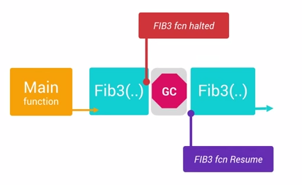

通常来说，单个的GC并不会占用太多时间，但是大量不停的GC操作则会显著占用帧间隔时间(**16ms**)。如果在帧间隔时间里面做了过多的GC操作，那么自然其他类似计算，渲染等操作的可用时间就变得少了。

##2.  Memory Monitor Walkthrough ##
**Android Studio** 中的 **Memory Monitor** 可以很好的帮助我们查看程序的内存使用情况。

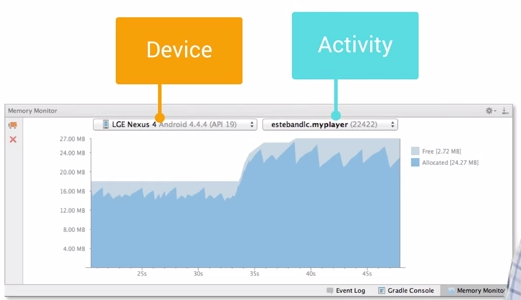

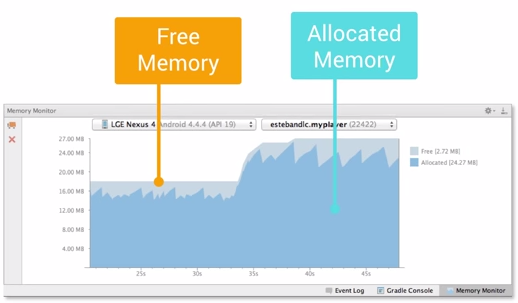

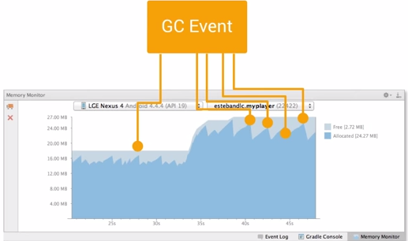

## 3. Memory Leaks ##
**内存泄漏**表示的是不再用到的对象因为被错误引用而无法进行回收。

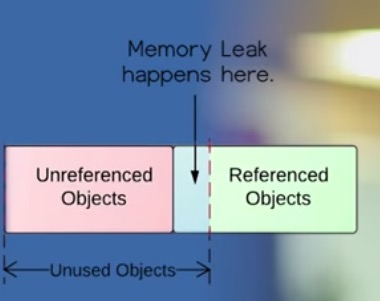

发生内存泄漏会导致 **Memory Generation** 中的剩余可用 **Heap Size** 越来越小，这样会导致频繁触发 **GC** ，更进一步引起性能问题。

举例内存泄漏，下面 `init()` 方法来自某个自定义View：

```java
private void init() {
	ListenerCollector collector = new ListenerCollector();	
	collector.setListener(this, mListener);
}
```

上面的例子容易存在内存泄漏，如果 **activity** 因为设备翻转而重新创建，自定义的View会自动重新把新创建出来的 **mListener** 给绑定到 **ListenerCollector** 中，但是当 **activity** 被销毁的时候，**mListener** 却无法被回收了。

## 4. Heap Viewer Walkthrough ##
下图演示了 **Android Tools** 里面的 **Heap Viewer** 的功能，我们可以看到当前进程中的 **Heap Size** 的情况，分别有哪些类型的数据，占比是多少。

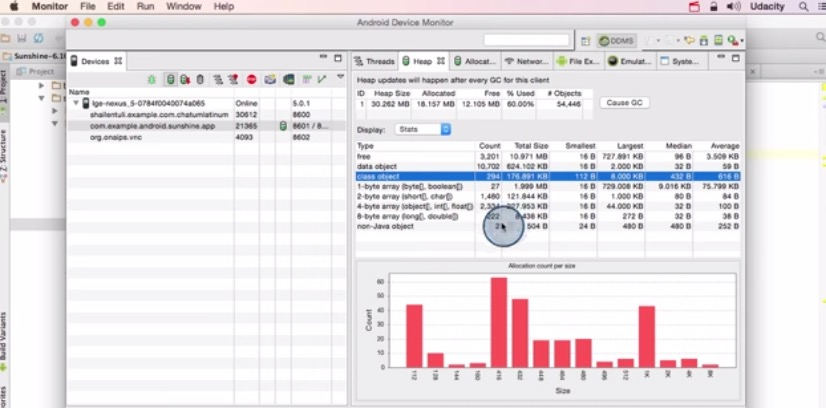

## 5. Understanding Memory Churn ##
**Memory Churn内存抖动:**内存抖动是因为在短时间内大量的对象被创建又马上被释放。瞬间产生大量的对象会严重占用Young Generation的内存区域，当达到阀值，剩余空间不够的时候，会触发GC从而导致刚产生的对象又很快被回收。即使每次分配的对象占用了很少的内存，但是他们叠加在一起会增加Heap的压力，从而触发更多其他类型的GC。这个操作有可能会影响到帧率，并使得用户感知到性能问题。

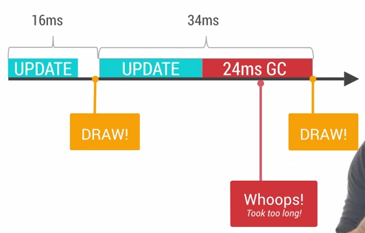

解决上面的问题有简洁直观方法，如果你在**Memory Monitor**里面查看到短时间发生了多次内存的涨跌，这意味着很有可能发生了内存抖动。

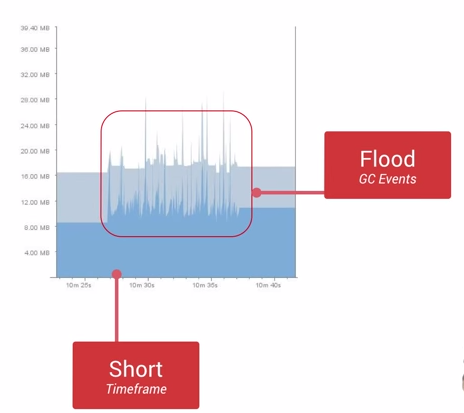

同时我们还可以通过**Allocation Tracker**来查看在短时间内，同一个栈中不断进出的相同对象。这是内存抖动的典型信号之一。

当你大致定位问题之后，接下去的问题修复也就显得相对直接简单了。**例如**，你需要避免在for循环里面分配对象占用内存，需要尝试把对象的创建移到循环体之外，自定义 **View** 中的 **onDraw** 方法也需要引起注意，每次屏幕发生绘制以及动画执行过程中，**onDraw** 方法都会被调用到，避免在onDraw方法里面执行复杂的操作，避免创建对象。对于那些无法避免需要创建对象的情况，我们可以考虑对象池模型，通过对象池来解决频繁创建与销毁的问题，但是这里需要注意结束使用之后，需要手动释放对象池中的对象。

## 6. Allocation Tracker ##
关于Allocation Tracker工具的使用，不展开了，参考下面的链接：
[http://developer.android.com/tools/debugging/ddms.html#alloc](http://developer.android.com/tools/debugging/ddms.html#alloc "http://developer.android.com/tools/debugging/ddms.html#alloc")

[http://android-developers.blogspot.com/2009/02/track-memory-allocations.html](http://android-developers.blogspot.com/2009/02/track-memory-allocations.html "http://android-developers.blogspot.com/2009/02/track-memory-allocations.html")

## 7. Improve Your Code To Reduce Churn ##
下面演示一个例子，如何通过修改代码来避免内存抖动。优化之前的内存检测图：

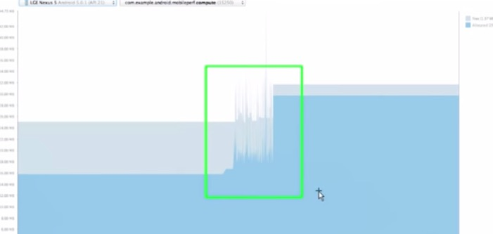

定位代码之后，修复了**String拼接**的问题：

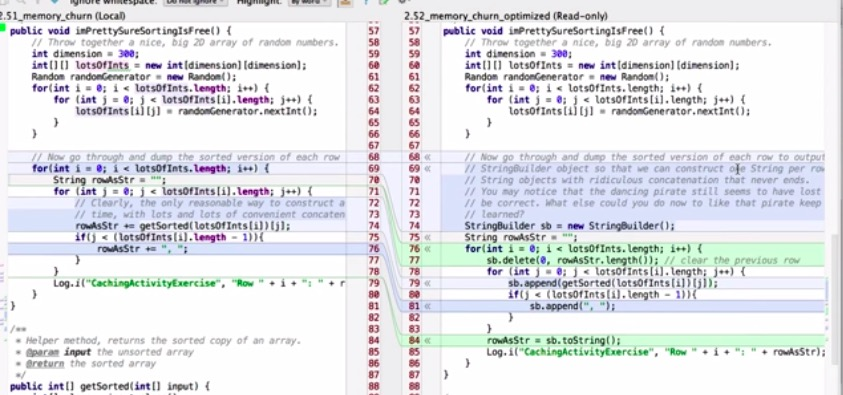

优化之后的内存监测图：

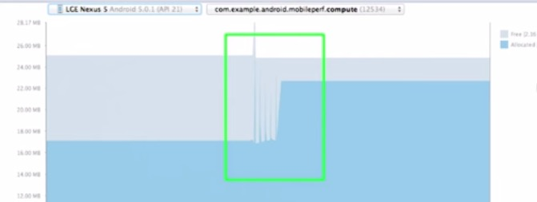

## 8. Recap ##
上面提到了三种测量内存的工具，下面再简要概括一下他们各自的特点：

- **Memory Monitor：**跟踪整个app的内存变化情况。
- **Heap Viewer：**查看当前内存快照，便于对比分析哪些对象有可能发生了泄漏。
- **Allocation Tracker：**追踪内存对象的来源。

**Notes:**关于更多内存优化，这里还有一篇文章，请点击[这里](https://www.baidu.com/)


