Android性能优化之过渡绘制
====
首先将讲解一下GPU过渡绘制，也是开发者最直接接触的部分吧，这个内容将分为两个部分来将讲，第一部分初步讲解一下gpu过渡绘制的原理，和一些优化建议，第二部分将用实际例子来讲解优化GPU过渡绘制的一般步骤。
# 第一部分 #
## 过渡绘制概念 ##
GPU过渡绘制的概念：GPU过度绘制指的是在屏幕一个像素上绘制多次(超过一次),比如一个TextView后有背景，那么显示文本的像素至少绘了两次，一次是背景，一次是文本。GPU过度绘制或多或少对性能有些影响,设备的内存带宽是有限的，当过度绘制导致应用需要更多的带宽(超过了可用带宽)的时候性能就会降低。带宽的限制每个设备都可能是不一样的。

## 过渡绘制的原因 ##
* 太多的View叠加
* 复杂的层级叠加
* 更长的inflation时间

## 过渡绘制和不合理的xml布局的影响 ##
* 布局文件是一个xml文件，inflate布局文件其实就是解析xml，根据标签信息创建相应的布局对象并做关联。xml中的标签和属性设置越多，节点树的深度越深，在解析时要执行的判断逻辑、函数的嵌套和递归就越多，所以时间消耗越多；
* inflate操作只是布局影响的第一个环节，一个界面要显示出来，在requestLayout后还要执行一系列的measure、layout、draw的操作，每一步的执行时间都会受到布局本身的影响。而界面的最终显示是所有这些操作完成后才实现的，所以如果布局质量差，会增加每一步操作的时间成本，最终显示时间就会比较长。

## 过渡绘制的一些基本概念: ##
Android提供了三个工具来帮助辨别和解决重绘问题：Hierachy Viewer，Tracer for OpenGL和Show GPU overdraw。前两个可以在ADT工具或者独立的monitor工具中找到，最后一个是在开发者选项的一部分.

* GPU过渡绘制测试:对于过度绘制的测试主要通过人工进行测试，也是发现应用过渡绘制的首选途径 .通过打开开发者选项中的 显示GPU过度绘制(魅族手机:设置—辅助功能—开发人员工具—硬件加速渲染—调试GPU过渡绘制— 显示过渡绘制区域. (魅族手机需要打开开发者模式：需要在电话界面输入: ##6961## )) 来进行测试（PS：只有android4.2及以上的版本才具备此功能)
* 颜色标识: GPU过渡绘制从好到差:蓝-绿-淡红-红
 * 蓝色1x过度绘制
 * 绿色2x过度绘制
 * 淡红色3x过度绘制
 * 红色超过4x过度绘制
* 验收标准:
 * 控制过度绘制为2x
 * 不允许存在4x过度绘制
 * 不允许存在面积超过屏幕1/4区域的3x过度绘制（淡红色区域）

## 优化工具介绍 ##
* Lint工具:
 * Eclipse中,点击即可,下面的窗口中会出现提示,根据提示和具体解决办法消除.
 * Android Studio自带Lint工具,不合理或者需要优化和注意的地方,会用黄色标记出来.
 * Lint工具不仅对布局有很好的优化建议,对代码中不合理的活着存在潜在风险的模块也会提出优化建议,所以一个好的建议是:多使用Lint工具检查自己的应用,尽量消除所有的建议.
 * Lint工具可以用命令行来运行,具体使用可以参考:[tools.android.com](http://androidperformance.com/2014/10/20/android-performance-optimization-overdraw-1/tools.android.com)
 
 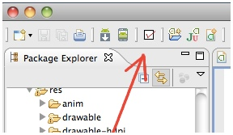

* Lint工具的提升例子(摘自官方文档):
 * Use compound drawables(使用compound drawables) - A LinearLayout which contains an ImageView and a TextView can be more efficiently handled as a compound drawable.
 * Merge root frame(使用Merge根框架) - If a FrameLayout is the root of a layout and does not provide background or padding etc, it can be replaced with a merge tag which is slightly more efficient.
 * Useless leaf(去除无用的分支) - A layout that has no children or no background can often be removed (since it is invisible) for a flatter and more efficient layout hierarchy.
 * Useless parent (去除无用的父控件)- A layout with children that has no siblings, is not a ScrollView or a root layout, and does not have a background, can be removed and have its children moved directly into the parent for a flatter and more efficient layout hierarchy.
 * Deep layouts (注意Layout的深度) - Layouts with too much nesting are bad for performance. Consider using flatter layouts such as RelativeLayout or GridLayout to improve performance. The default maximum depth is
* Hierarchy Viewer:此工具是一个ADT工具（或者monitor,最新版本的SDK建议不使用独立的HV工具,而是直接在monitor中进行操作.）的一部分，可以被用作对视图层级进行快速解读。在处理布局问题时特别有用，对于性能问题也很适用。Hierarchy Viewer默认只能在非加密设备使用，例如工程机，工程平板或者模拟器。为了能够在任何手机上使用Hierarchy Viewer，你得在你的应用中添加ViewServer，这是一个开源库,使用方法可以参考这里。连接上设备，打开Hierarchy Viewer(定位到tools/目录下，直接执行hierarchyviewer的命令，选定需要查看的Process，再点击Load View Hierarchy会显示出当前界面的布局Tree。在每个模块的Traffic light上有三个灯，分别代表了Measure, Layout and Draw三个步骤的性能。

## 布局优化建议 ##
在Android UI布局过程中，通过遵守一些惯用、有效的布局原则，我们可以制作出高效且复用性高的UI，概括来说包括如下几点：

* 尽量多使用RelativeLayout和LinearLayout, 不要使用绝对布局AbsoluteLayout，
 * 在布局层次一样的情况下， 建议使用LinearLayout代替RelativeLayout, 因为LinearLayout性能要稍高一点.
 * 在完成相对较复杂的布局时,建议使用RelativeLayout,RelativeLayout可以简单实现LinearLayout嵌套才能实现的布局.
* 将可复用的组件抽取出来并通过include标签使用；
* 使用ViewStub标签来加载一些不常用的布局；
* 动态地inflation view性能要比SetVisiblity性能要好.当然用VIewStub是最好的选择.
* 使用merge标签减少布局的嵌套层次
* 去掉多余的背景颜色(查看背景颜色是否多余,可以将HierarchyView中的图导出为psd文件,然后用Photoshop查看.具体可以参考这个[视频](https://www.youtube.com/watch?v=URyoiAt8098))
 * 对于有多层背景颜色的Layout来说,留最上面一层的颜色即可,其他底层的颜色都可以去掉
 * 对于使用Selector当背景的Layout(比如ListView的Item,会使用Selector来标记点击,选择等不同的状态),可以将normal状态的color设置为\”@android:color/transparent”,来解决对应的问题
* 内嵌使用包含layout_weight属性的LinearLayout会在绘制时花费昂贵的系统资源，因为每一个子组件都需要被测量两次。在使用ListView与GridView的时候，这个问题显的尤其重要，因为子组件会重复被创建.所以要尽量避免使用Layout_weight
* 使得Layout宽而浅，而不是窄而深（在Hierarchy Viewer的Tree视图里面体现）

## 源码相关 ##
另外有能力看源码的同学，下面是绘制OverDraw的源码位置：/frameworks/base/libs/hwui/OpenGLRenderer.cpp,有兴趣的可以去研究研究。

```cpp
void OpenGLRenderer::renderOverdraw() {
    if (mCaches.debugOverdraw &amp;&amp; getTargetFbo() == 0) {
        const Rect* clip = &amp;mTilingClip;

        mCaches.enableScissor();
        mCaches.setScissor(clip-&gt;left, mFirstSnapshot-&gt;height - clip-&gt;bottom,
                clip-&gt;right - clip-&gt;left, clip-&gt;bottom - clip-&gt;top);

        // 1x overdraw
        mCaches.stencil.enableDebugTest(2);
        drawColor(mCaches.getOverdrawColor(1), SkXfermode::kSrcOver_Mode);

        // 2x overdraw
        mCaches.stencil.enableDebugTest(3);
        drawColor(mCaches.getOverdrawColor(2), SkXfermode::kSrcOver_Mode);

        // 3x overdraw
        mCaches.stencil.enableDebugTest(4);
        drawColor(mCaches.getOverdrawColor(3), SkXfermode::kSrcOver_Mode);

        // 4x overdraw and higher
        mCaches.stencil.enableDebugTest(4, true);
        drawColor(mCaches.getOverdrawColor(4), SkXfermode::kSrcOver_Mode);

        mCaches.stencil.disable();
    }
}

void OpenGLRenderer::countOverdraw() {
    size_t count = mWidth * mHeight;
    uint32_t* buffer = new uint32_t[count];
    glReadPixels(0, 0, mWidth, mHeight, GL_RGBA, GL_UNSIGNED_BYTE, &amp;buffer[0]);

    size_t total = 0;
    for (size_t i = 0; i &lt; count; i++) {
        total += buffer[i] &amp; 0xff;
    }

    mOverdraw = total / float(count);

    delete[] buffer;
}
```

还有QA可能用得到的一个指标：OverDraw数值，这个的源码位置在Framework/base/core/java/android/view/HardwareRender.java中(5.0中去掉了这个数值的显示)

```java
private void debugOverdraw(View.AttachInfo attachInfo, Rect dirty,
                HardwareCanvas canvas, DisplayList displayList) {

            if (mDebugOverdraw == OVERDRAW_TYPE_COUNT) {
                if (mDebugOverdrawLayer == null) {
                    mDebugOverdrawLayer = createHardwareLayer(mWidth, mHeight, true);
                } else if (mDebugOverdrawLayer.getWidth() != mWidth ||
                        mDebugOverdrawLayer.getHeight() != mHeight) {
                    mDebugOverdrawLayer.resize(mWidth, mHeight);
                }

                if (!mDebugOverdrawLayer.isValid()) {
                    mDebugOverdraw = -1;
                    return;
                }

                HardwareCanvas layerCanvas = mDebugOverdrawLayer.start(canvas, dirty);
                countOverdraw(layerCanvas);
                final int restoreCount = layerCanvas.save();
                layerCanvas.drawDisplayList(displayList, null, DisplayList.FLAG_CLIP_CHILDREN);
                layerCanvas.restoreToCount(restoreCount);
                mDebugOverdrawLayer.end(canvas);

                float overdraw = getOverdraw(layerCanvas);
                DisplayMetrics metrics = attachInfo.mRootView.getResources().getDisplayMetrics();

                drawOverdrawCounter(canvas, overdraw, metrics.density);
            }
}

private void drawOverdrawCounter(HardwareCanvas canvas, float overdraw, float density) {
            final String text = String.format(\"%.2fx\", overdraw);
            final Paint paint = setupPaint(density);
            // HSBtoColor will clamp the values in the 0..1 range
            paint.setColor(Color.HSBtoColor(0.28f - 0.28f * overdraw / 3.5f, 0.8f, 1.0f));

            canvas.drawText(text, density * 4.0f, mHeight - paint.getFontMetrics().bottom, paint);
}
```

# 第二部分 #
## 前言 ##
第一部分讲解了一下什么是过渡绘制，以及可以用来查看和确认过渡绘制的工具，还提供了一些优化过渡绘制的方法。对代码和布局比较熟悉的人，看完上一篇其实就已经可以对自己的应用进行优化了。我记得有人说过，用iphone你只需要保证苹果有节操即可，用Android你就得保证所有的Android开发者都有节操。但现实是残酷的，现在Android市场上，有很多粗制滥造的应用，其中不乏大厂之作，各位打开过渡绘制按钮，就知道我所言非虚。作为一个Android开发人员，我肯定是更希望Android能一步一步好起来，超越iphone。第二部分从实战的角度，讲解了一个过渡绘制的优化过程。当然这里用到的只是很少的一部分，毕竟每个应用差别很大，优化方式也各不一样。所以这篇文章仅供参考，想把这块做好还是要下功夫的。

## 定位过渡绘制区域 ##
### 打开GPU过渡绘制选项: ###
设置—辅助功能—开发人员工具—硬件加速渲染—调试GPU过渡绘制— 显示过渡绘制区域.
### 清理后台: ###
Kill掉(即清后台)要测试的应用,重新打开就可以看到效果.下面以文件管理器和设置为例子,如下图
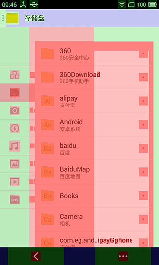
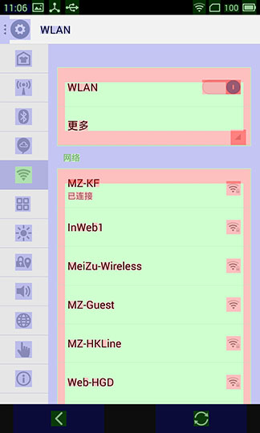

从图上可以看出,按照过渡绘制从好到坏(蓝-绿-粉红-红)来看,文件管理器的过渡绘制是非常严重的,而设置界面的过渡绘制则在可以接受的范围内.下面就以文件管理器为主要分析对象,来看看如何对文件管理器的过渡绘制进行优化.
### 从文件管理器的图,分析出过渡绘制区域: ###
* 首先看最上面的ActionBar和最下面的SmartBar,对比设置界面的ActionBar就可以知道,整个文件管理器存在一个不透明的背景,导致每次绘制时,都要先绘制这个看不见且不透明的背景.这个背景一般是应用的主题自带的背景,所以GPU过渡绘制显示其位蓝色,这个背景是可以进行优化的.
* 中间的内容部分,最底层是绿色,说明进行了2x的过渡绘制,去掉第一条我们提的那个全局背景,还有一层背景,也就是1x的过渡绘制,对比setting可知,这个背景色也是可以去掉的.
* 最容易看出的是这两条,我们先分析和优化这两条,然后再进行其他的优化.

## 优化过渡绘制区域 ##
在进行位置确认后，我们大概确定了过渡绘制的区域,让我们来使用工具来进行验证和View确认.

打开Monitor(Eclipse和Android Studio中都有快捷打开按钮,即DDMS,右上角选择 Hierarchy View,大概使用如图：
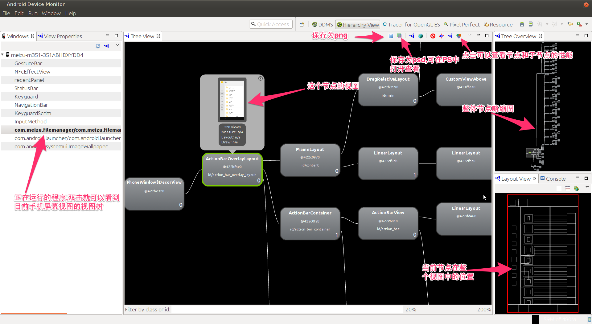

其中根节点:PhoneWindos$DecorView是整个视图的根节点,唯一的子节点是ActionBarOverlayLayout,这个Layout包含了ActionBar,应用程序,以及SmartBar.

下面讲述如何从Hierarchy View结合代码分析出需要进行修改的区域

### 去除默认背景 ###
上面分析过渡绘制区域的第一条,整个window存在一个背景,所以进行了一次重绘,这个背景的重绘是系统级别的,和主题有关,即这个背景是属于ActionBarOverlayLayout的.这种类型的过渡绘制解决也比较方便,在文件管理器的主Activity的onCreate方法中,加入

`this.getWindow().setBackgroundDrawableResource(android.R.color.transparent);`

就可以将这个看不见的主题背景去掉.下面是去掉主题背景后的效果图(一张是划开,一张是没有划开):

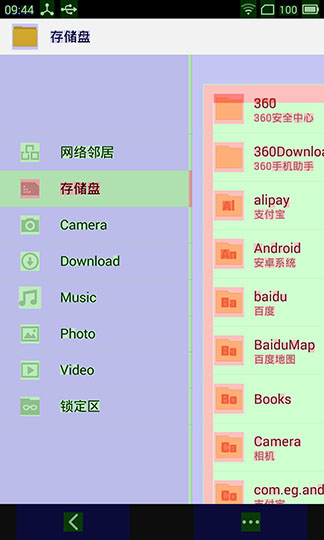
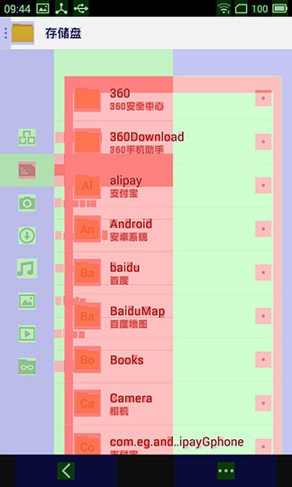

对比优化前的图可以发现,背景被去掉之后,少了一层过渡绘制. ActionBar上的蓝色已经消失了.中间的内容由绿色变为蓝色

### 消除子控件背景 ###
上面分析的第二条说”中间的内容部分,最底层是绿色,说明进行了2x的过渡绘制”,现在中间部分变成了蓝色,但是这是一个全局的背景,导致右边的view拉过来之后,还是存在大量的红色和绿色. 继续分析Hierarchy View,找到中间view对应的视图:DragRelativeLayout,查看源码可知,DragRelativeLayout继承自公共控件:SlidingMenu ，SlidingMenu 由CustomViewAbove和CustomViewBehind组成,前者是上面可以左右拉动的那部分,后者是底部不能拉动的那部分(这个从HierarchyView中也可以看出来:如下图所示:

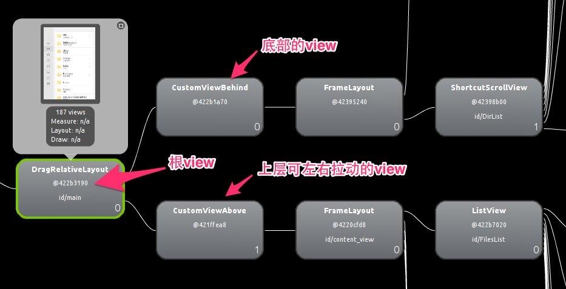

点击CustomViewBehind,查看其所占的区域,就可以发现背景是这个View进行绘制的,打开CustomViewBehind的代码可以发现其构造函数中包含下面的代码:
`setBackgroundColor(getResources().getColor(R.color.mz_slidingmenu_background_light));`

这个背景是不需要的,查看源码可知,这个view会在SlidingMenu.setMenu的时候,被覆盖掉,还是看不到的.所以这一层view是可以去掉的.下面是去掉一层背景之后的预览图:

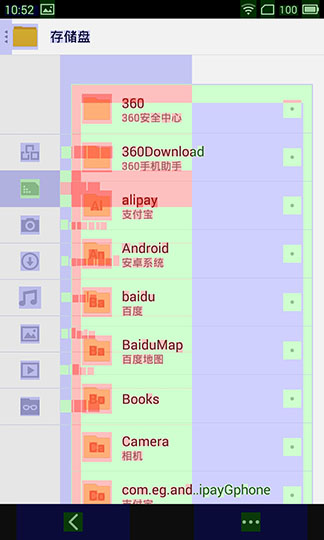
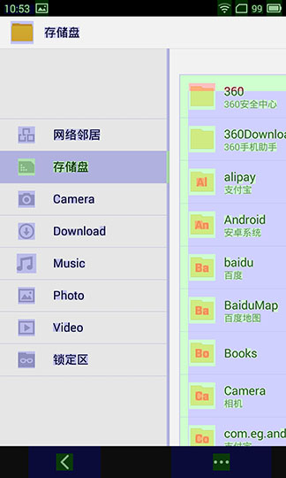

可以看到这一层背景去掉之后,过渡绘制减轻了很多.

### 进一步优化 ###
接着进行分析,可以看到CustomViewAbove也是存在一个过渡绘制的背景的,查看Hierarchy View的CustomViewAbove的子节点,可以看到过渡绘制是由ListView导致的.其id为:FilesList,在代码中找到它,并对他进行分析.在我将PartitionItemLayout中onDraw()函数的setBounds去掉之后,过渡绘制进一步改善了(但是ListItem的View的颜色也比之前要浅了,这一步优化需要根据具体情况进行) 下面是优化后的效果图:

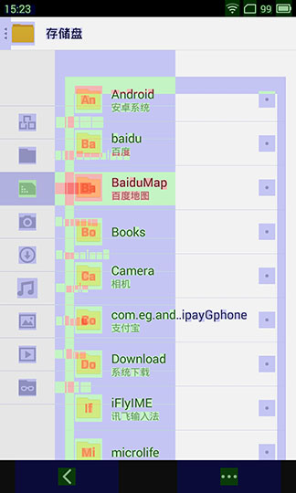
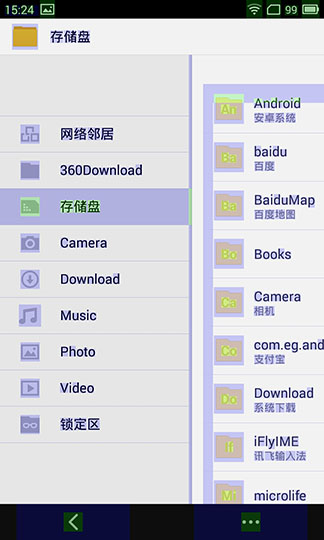

可以看到图中的过渡绘制已经非常少了.!点个赞!

## 优化代码 ##
### Lint工具 ###
Lint工具的使用比较简单,根据给出的提示做对应的修改即可.有时候需要工具具体情况来确定是否需要修改. 下图是一个简单地例子.箭头处提示这个Layout或者它的父Layout是不必须的.具体修改方法即去掉FrameLayout,将RelativeLayout提升为根VIew即可.

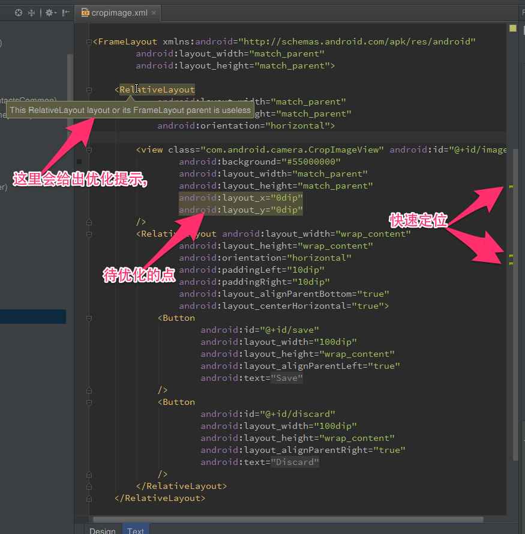

Lint工具还会针对代码中潜在的不合理或者Bed Code做出修改意见.比较重要的提示包括：

* 声明但是没有使用的变量
* 可能会产生的空指针
* 没必要书写的return,continue
* 复杂代码的简化写法
* for循环的简化写法:foreach
* 无效的判空
* 空if
* 无效或者未使用的import
### 使用Tracer For OpenGL ES ###
Tracer工具也在Android Device Monitor中.点击右上角的Tracer for OpenGL ES按钮就可以进入(如果没有这个按钮,点击旁边的Open Perspective按钮,从选项中选择Tracer for OpenGL ES即可).初次打开Tracer工具,里面是没有内容的,点击右上角的两个按钮(一个是打开现有的GLTrace文件,另一个是新建GLTrace文件)。点击Trace按钮, 手机会自动启动应用程序并启动对应的Activity,当手机上的内容完全绘制出来之后,就可以点击Stop按钮,生成GlTrace文件.文件会自动打开.

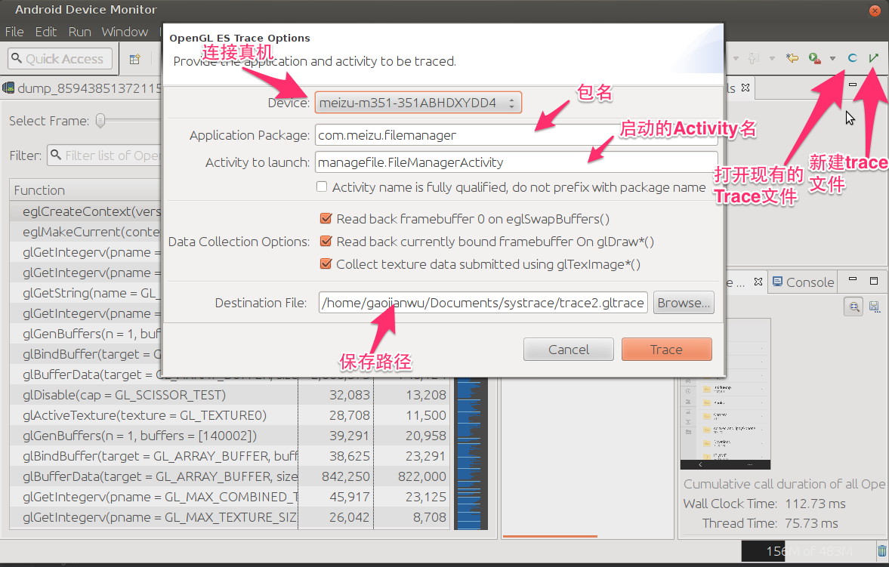

分析GLTrace文件，下图是优化过后的图,对比优化前的图可以发现,优化后不会去绘制默认的背景图和CustomViewBehind的背景图.

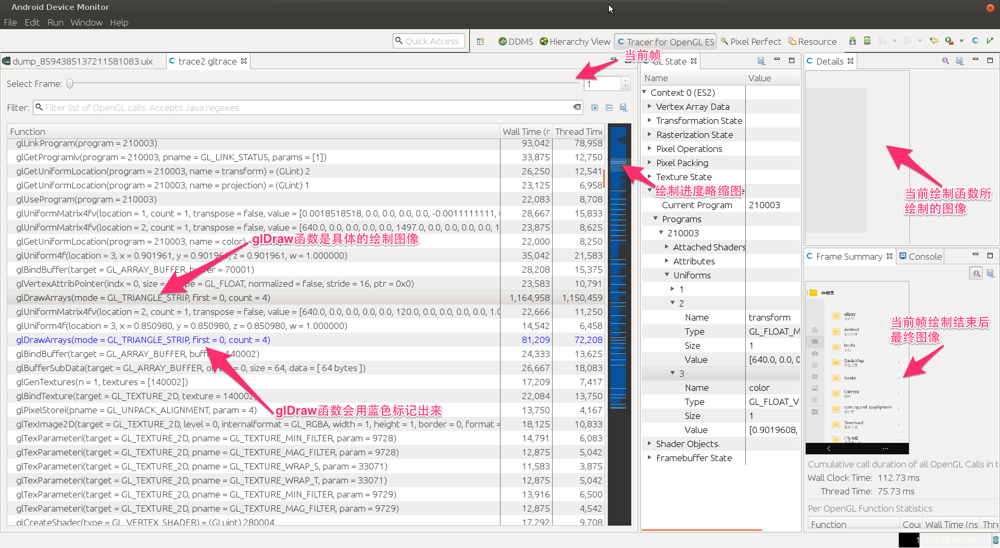

这只是一帧的绘制,如果多操作几下生成多个帧的绘制trace文件,会发现这两个背景会被多次的重绘,去掉后不仅会减轻过渡绘制,也会加快GUP的绘制速度.

---

## 参考资料 ##
* [优化过程](http://www.curious-creature.org/2012/12/01/android-performance-case-study/ "优化过程")
* [反编译并添加gpu显示](http://blog.csdn.net/yihongyuelan/article/details/12169647 "反编译并添加gpu显示")
* [http://developer.android.com/training/improving-layouts/optimizing-layout.html#Inspect](http://developer.android.com/training/improving-layouts/optimizing-layout.html#Inspect)
* [http://developer.android.com/training/improving-layouts/reusing-layouts.html](http://developer.android.com/training/improving-layouts/reusing-layouts.html)
* [http://developer.android.com/training/improving-layouts/loading-ondemand.html](http://developer.android.com/training/improving-layouts/loading-ondemand.html)
* [http://developer.android.com/training/improving-layouts/smooth-scrolling.html](http://developer.android.com/training/improving-layouts/smooth-scrolling.html)
* [http://developer.android.com/tools/help/hierarchy-viewer.html](http://developer.android.com/tools/help/hierarchy-viewer.html)
* [http://tools.android.com/tips/lint](http://tools.android.com/tips/lint)

> 作者：[Gracker](http://weibo.com/1315612820/profile?topnav=1&wvr=6)
> 
> 出处：[androidperformance.com](http://androidperformance.com/2014/10/20/android-performance-optimization-overdraw-1/)
> 
> 本文版权归作者所有，欢迎转载，但未经作者同意必须保留此段声明，且在文章页面明显位置给出原文连接，否则保留追究法律责任的权利。
